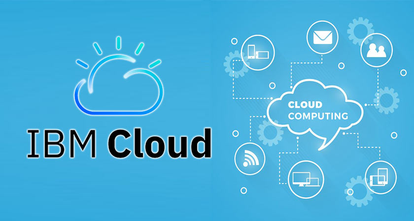

# Cloud

En esta sección podrás encontrar todo el contenido relacionado a Cloud Computing.

Cloud computing es el acceso on-demand, a través de Internet, a recursos informáticos (aplicaciones, servidores físicos o virtuales, almacenamiento de datos, herramientas de desarrollo, capacidades de red, etc.) alojados en un centro de datos remoto administrado por un proveedor de servicios en la nube (CSP). El CSP pone a disposición estos recursos a cambio de una tarifa de suscripción mensual o los factura en función de su uso.

Para más información, consulta [nuestro artículo sobre Cloud Computing](https://developer.ibm.com/es/articles/intro-a-cloud-computing/).

## Índice

- [Code Engine: cómo ejecutar tareas periódicas en dos simples pasos](./code_pattern-ejecutar_tareas_periodicas_en_dos_simples_pasos/README.md)
- [Incluyendo políticas como código para validar su despliegue de IBM Schematics](./code_pattern-incluyendo_politicas_como_codigo_ibm_schematics/README.MD)

<!-- > FORMATO PARA AGREGAR UN NUEVO PATTERN AL ÍNDICE (COPIAR LINEA DE ABAJO) <-->
<!-- > - [Título Completo Code Pattern](./nombre-carpeta-code-pattern/README.md) <-->

## Contribuciones

Para más información sobre cómo contribuir a este repositorio, dirígete a [la sección de contribuciones](../../docs/CONTRIBUITING.md).

## Navegación

- [↗ Volver al Inicio](../../README.md)