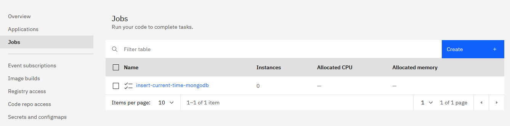
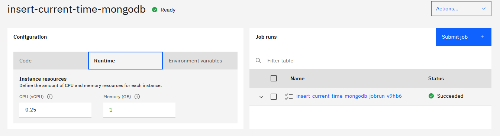
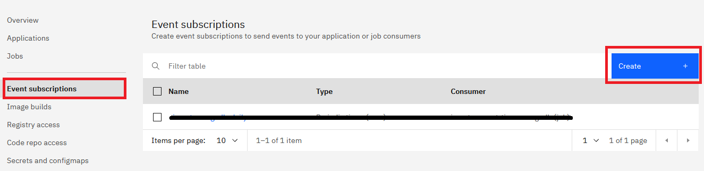
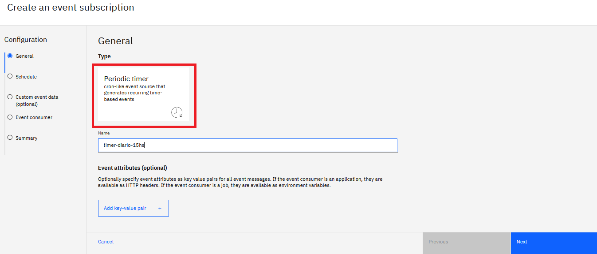
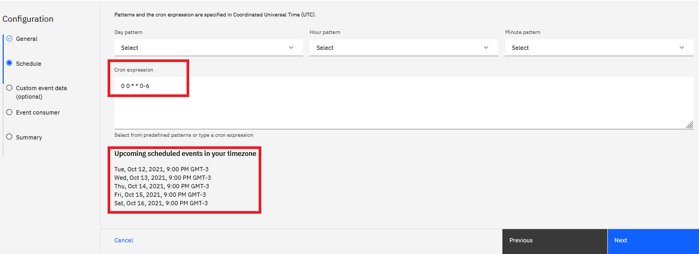
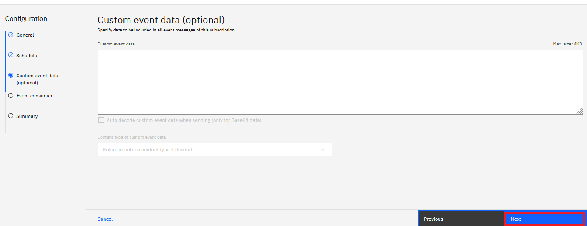
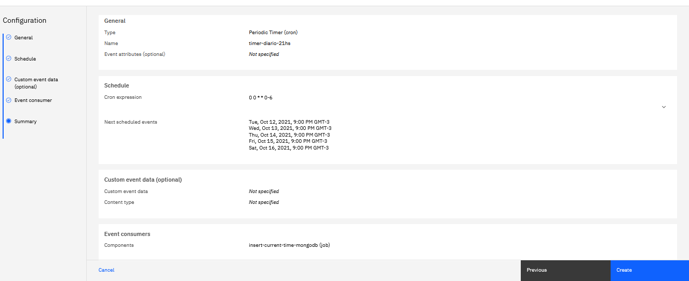
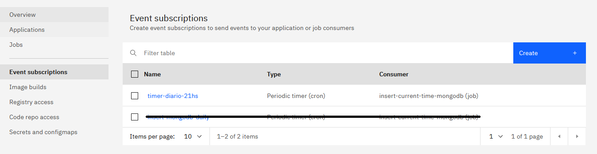
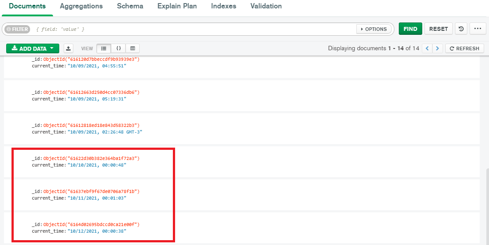

# Code Engine: cómo ejecutar tareas periódicas en dos simples pasos

## Introducción

Code Engine es una plataforma serverless que ofrece una combinación perfecta entre serverless y Kubernetes, permitiendo ejecutar cargas de trabajo en contenedores de manera ágil y sencilla, ofreciendo todas las ventajas de Kubernetes, sin ninguna de las complejidades. Para más información sobre el servicio, se recomienda [consultar la documentación oficial](https://cloud.ibm.com/docs/codeengine?topic=codeengine-getting-started).

En este Code Pattern aprenderás a asociar un *trigger* (suscripción) de tipo `cron` a un despliegue **preexistente** en Code Engine para que se ejecute de forma periódica, a las 21hs GMT-3.

Realizaremos esta tarea de dos maneras diferentes:

1. Utilizando la interfaz de usuario provista por IBM Cloud
2. Empleando la CLI de IBM Cloud

## Requisitos previos

* Contar con una [Cuenta en IBM Cloud](https://cloud.ibm.com/registration)
* Instalar la [IBM Cloud CLI](https://cloud.ibm.com/docs/containers?topic=containers-cs_cli_install) (sólo para la opción 2)
* Contar con un despliegue en IBM Code Engine. Puedes aprender a hacerlo [en este tutorial de IBM Developer en Español](https://developer.ibm.com/es/tutorials/code-engine-como-desplegar-aplicaciones-en-2-simples-pasos/).

Adicionalmente, si deseas utilizar la aplicación provista en este Code Pattern, deberás:

- Contar con una instancia de MongoDB. IBM Cloud cuenta con el servicio [Databases for MongoDB](https://cloud.ibm.com/databases/databases-for-mongodb/create) que permite crear una instancia SaaS de forma muy sencilla.
- Desplegar la [aplicación](./source/insert-current-time-mongodb/) como `job` en Code Engine. Puedes [utilizar este tutorial](https://developer.ibm.com/es/tutorials/code-engine-como-desplegar-aplicaciones-en-2-simples-pasos/) para ello, seleccionando la opción `Job` en lugar de `Application` al realizar el despliegue.

## Tiempo Estimado

El tiempo estimado para este Code Pattern es de **20 minutos**.

## Marco Teórico

### IBM Code Engine

IBM Cloud™ Code Engine es una plataforma serverless desarrollada por IBM con el objetivo de ayudar a los desarrolladores en el proceso de creación de aplicaciones y trabajos modernos, contenerizados y *serverless*. Code Engine abstrae la carga operativa de crear, implementar y administrar cargas de trabajo en Kubernetes para que los desarrolladores puedan concentrarse en lo que más les importa: el código fuente.

Para conocer más, visita la [documentación oficial del servicio](https://cloud.ibm.com/docs/codeengine?topic=codeengine-about).

### Terminología de Code Engine

- **Proyecto:** un proyecto es una agrupación de entidades de Code Engine, como aplicaciones, trabajos y compilaciones. Los proyectos se utilizan para administrar recursos y proporcionar acceso a sus entidades.
- **Aplicación:** una aplicación (app) ejecuta su código para responder a solicitudes HTTP. Posee una URL para las solicitudes entrantes. El número de instancias en ejecución de una aplicación se escala automáticamente hacia arriba o hacia abajo (hasta cero) según la carga de trabajo entrante.
- **Compilación (Build):** la compilación o *build* es un mecanismo que permite crear una imágenes de contenedor a partir de código fuente. Code Engine admite la compilación a partir de un Dockerfile o de Cloud Native Buildpacks.
- **Trabajo (Job):** un trabajo es una ejecución de código pero que, a diferencia de las aplicaciones, están diseñados para ejecutarse una vez y salir. Es análogo al concepto de aplicación *batch* o trabajo de lotes.

### Cron Jobs

Para configurar la ejecución periódica de tareas en Code Engine, utilizaremos los denominados "cron jobs".

[Cron (enlace fuera de IBM)](https://en.wikipedia.org/wiki/Cron) es un programador de tareas utilizado en sistemas operativos de tipo Unix. Permite programar trabajos (tareas batch) para que sean ejecutados periódicamente en horas, fechas o intervalos fijos de tiempo.

La sintaxis de una expresión `cron` es la siguiente:

```
 ┌───────────── minuto (0 - 59)
 │ ┌───────────── hora (0 - 23)
 │ │ ┌───────────── día del mes (1 - 31)
 │ │ │ ┌───────────── mes (1 - 12)
 │ │ │ │ ┌───────────── día de la semana (0 - 6) (Domingo a Sábado)
 │ │ │ │ │
 │ │ │ │ │
 │ │ │ │ │
 * * * * *
```

**Nota:** los patrones cron se especifican en Coordinated Universal Time (UTC).

## Secuencia

- [Paso Previo: despliegue en Code Engine](#paso-previo-despliegue-en-code-engine)
- [Opción 1: Interfaz Web de IBM Cloud](#opción-1-interfaz-web-de-ibm-cloud)
  - [Paso 1. Acceso a IBM Cloud](#paso-1-acceso-a-ibm-cloud)
  - [Paso 2. Creación de subscripción](#paso-2-creación-de-subscripción)
- [Opción 2: IBM Cloud CLI](#opción-2-ibm-cloud-cli)
  - [Paso 0. Instalación de dependencias](#paso-0-instalación-de-dependencias)
  - [Paso 1. Selección de Proyecto](#paso-1-selección-de-proyecto)
  - [Paso 2. Creación de Suscripción](#paso-2-creación-de-suscripción)

### Paso Previo: despliegue en Code Engine

Para configurar una tarea periódica, es necesario desplegar un trabajo en Code Engine. Este proceso puede realizarse utilizando una imagen contenerizada o el código fuente, ya sea desde la consola de comandos (CLI) o la interfaz web de IBM Cloud (GUI). En mi caso, he desplegado una [aplicación batch en NodeJS](./source/insert-current-time-mongodb/) llamada `insert-current-time-mongodb` que se conecta a una base de datos [MongoDB SaaS en IBM Cloud](https://cloud.ibm.com/databases/databases-for-mongodb/create) e inserta un JSON con el siguiente formato:

```json
{
    "current_time" : "mm/dd/yyyy HH:MM:SS GMT-3"
}
```

Para desplegar un trabajo o aplicación en Code Engine, visita [nuestro tutorial de IBM Developer](https://developer.ibm.com/es/tutorials/code-engine-como-desplegar-aplicaciones-en-2-simples-pasos/).

El objetivo de este Code Pattern configurar un *trigger* para que un despliegue de Code Engine se ejecute diariamente a las 21:00hs (GMT-3).

Si alguien configurara esta ejecución para la aplicación NodeJS `insert-current-time-mongodb` el 15/11/2021 y obtuviera todos los registros de la base de datos transcurrida una semana, debería de obtener un resultado similar al siguiente:

```json
[
    {
    "current_time" : "11/15/2021 21:01:06 GMT-3"
    },
    {
    "current_time" : "11/16/2021 21:01:03 GMT-3"
    },
    {
    "current_time" : "11/17/2021 21:00:41 GMT-3"
    },
    {
    "current_time" : "11/18/2021 21:00:20 GMT-3"
    },
    {
    "current_time" : "11/19/2021 21:00:20 GMT-3"
    },
    {
    "current_time" : "11/20/2021 21:00:20 GMT-3"
    },
    {
    "current_time" : "11/21/2021 21:00:20 GMT-3"
    }
]
```

### Opción 1: Interfaz Web de IBM Cloud

#### Paso 1. Acceso a IBM Cloud

El primer paso será [acceder a Code Engine en IBM Cloud](https://cloud.ibm.com/codeengine/), y verificar que el trabajo se encuentra desplegado en la nube.



En mi caso, el trabajo desplegado se llama `insert-current-time-mongodb`. Es posible obtener mayor información haciendo click en él.



Si todo se encuentra correctamente configurado, el valor de la columna `Status` debería ser `Succeeded`.

#### Paso 2. Creación de subscripción

Desde la vista de proyecto, dirígete a `Event subscriptions` y haz click en `Create +`.



Selecciona `Periodic timer`, coloca un nombre y haz click en `Next`. En mi caso, el nombre es `timer-diario-21hs`.



**Nota:** en caso de necesitar configurar parámetros (atributos) para el evento, haz click en `Add key-value pair`. Si el despliegue es una aplicación, se los tratará como headers HTTP. Si es un trabajo, serán variables de entorno.

Ahora deberás establecer la periodicidad utilizando la [nomenclatura cron](#cron-jobs) que vimos antes. Para un trigger diario, a las 21hs (GMT-3), deberás colocar:

```
0 0 * * 0-6
```

Puedes verificar que los valores sean correctos en la sección de `Upcoming scheduled events in your timezone`, como se muestra en la siguiente imagen:



Hecho esto, haz click en `Next`.

En la sección `Custom event data (optional)` podrás configurar qué datos deseas sean incluidos en el cuerpo del mensaje del evento. No será necesario en este caso, por lo que deberás hacer click en `Next` sin realizar cambio alguno.



Ahora, deberás seleccionar la aplicación o trabajo que consumirá el evento. En este caso será el trabajo `insert-current-time-mongodb`, previamente desplegado. Selecciona tu despliegue y haz click en `Next`.

**Nota:** si el despliegue es de tipo aplicación, puedes establecer la ruta donde se encuentra el comportamiento a ejecutar, en el textbox `Path`.

Habiendo configurado los elementos necesarios, podrás ver un sumario en la pestaña `Summary`.



Puedes retornar a las secciones anteriores con el botón `Previous`. Cuando todo esté listo, haz click en `Create`.

¡Y listo! Si vas a la pestaña de `Event subscriptions` podrás ver el nuevo *trigger* que has creado:



Como comprobación adicional, he ido a mi base de datos unos días más tarde y pude comprobar que las inserciones se realizaron correctamente:



### Opción 2: IBM Cloud CLI

La segunda opción es utilizar la CLI de IBM Cloud desde la consola de comandos.

#### Paso 0. Instalación de dependencias

Como paso previo, deberá haberse el plugin de Code Engine con el siguiente comando:

```
ibmcloud plugin install code-engine
```

Se puede verificar la instalación ejecutando el siguiente comando:

```
ibmcloud ce help
```

Para más información, consultar la [sección CLI del servicio](https://cloud.ibm.com/codeengine/cli).

#### Paso 1. Selección de Proyecto

Antes de proceder, deberás haber iniciado sesión en IBM Cloud con el comando `ibmcloud login` y verificar que se hayan seleccionado la cuenta, región y grupo de recursos correctos con el comando `ibmcloud target`.

Para más información, consultar la documentación de los comandos [``ibmcloud login``](https://cloud.ibm.com/docs/cli?topic=cli-ibmcloud_cli#ibmcloud_login) e [``ibmcloud target``](https://cloud.ibm.com/docs/cli?topic=cli-ibmcloud_cli#ibmcloud_target).

Habiendo hecho esto, selecciona el proyecto donde se encuentra desplegada la aplicación:

```
ibmcloud ce project select --name <nombre_proyecto>
```

Puedes listar los proyectos existentes con el comando `ibmcloud ce project list`.

#### Paso 2. Creación de Suscripción

Crea una suscripción cron con el siguiente comando:

```bash
ibmcloud ce subscription cron create --name <nombre_suscripción>  --destination <nombre_despliegue> --destination-type <tipo_despliegue> --schedule "<expresión_cron>"
```

Donde:

- `name` es el nombre con el que se creará la suscripción.
- `destination` es el nombre de la aplicación o trabajo desplegado en Code Engine.
- `destination-type` es el tipo de despliegue en Code Engine. Puede ser `app` o `job`. El valor por defecto es `app`.
- `schedule` es la [expresión cron](#cron-jobs) que indicará la frecuencia con la que se ejecutará el trabajo o aplicación desplegados.

Para más información acerca del comando `ibmcloud ce subscription cron create` visita [la documentación del servicio](https://cloud.ibm.com/docs/codeengine?topic=codeengine-cli#cli-subscription-cron-create).

Para crear una suscripción para el trabajo `insert-current-time-mongodb` de nombre `timer-diario-21hs` y que se ejecute diariamente a las 21hs GMT-3, se deberá ejecutar el comando de creación con los siguientes parámetros:

```bash
ibmcloud ce subscription cron create --name timer-diario-21hs  --destination insert-current-time-mongodb --destination-type job --schedule "0 0 * * 0-6"
```

La salida en consola deberá lucir de esta forma:

```bash
Creating cron event subscription 'timer-diario-21hs'...
Run 'ibmcloud ce subscription cron get -n timer-diario-21hs' to check the cron event subscription status.
OK
```

¡Y listo! El *trigger* ha sido creado y podrás ver los cambios reflejados en tu aplicación.

Si, por otra parte, desplegaste la aplicación `insert-current-time-mongodb` provista en este Code Pattern, puedes configurar tus credenciales en [el archivo .env](source/get-records-mongodb/.env) y ejecutar [este script de Python](./source/get-records-mongodb/get_db_records.py) y ver los resultados.

# Resumen

En este Code Pattern:

- Se brindó una breve overview del nuevo servicio de IBM Cloud: Code Engine, así como terminología básica del mismo.
- Se introdujo el concepto de `cron jobs`.
- Se creó, en dos simples pasos, una suscripción para que un despliegue de Code Engine se ejecute de forma periódica. Se expuso cómo realizar este proceso mediante dos caminos: la interfaz gráfica de IBM Cloud, y la CLI de IBM Cloud.

# Enlaces de interés

- [Sitio oficial de IBM - Code Engine](https://www.ibm.com/cloud/code-engine)
- [Documentación oficial - Getting started with IBM Cloud Code Engine](https://cloud.ibm.com/docs/codeengine?topic=codeengine-getting-started)
- [Documentación oficial - Getting started with subscriptions](https://cloud.ibm.com/docs/codeengine?topic=codeengine-subscribing-events)
- [Documentación oficial - Working with the Periodic timer (cron) event producer](https://cloud.ibm.com/docs/codeengine?topic=codeengine-subscribe-cron)