## Incluyendo políticas como código para validar su despliegue de IBM Schematics.
---
En este code pattern preparará un pipeline para el despliegue de recursos en la nube, utilizando IBM Schematics, IBM Continuous Delivery (Tekton), IBM Toolchain y Rego.

Cuando haya completado este code pattern, entenderá como:

* Crear un workspace de IBM Schematics para ejecutar la creacion de recursos con Terraform.
* Crear un Delivery Pipeline con multiples repositorios.
* Escribir politicas mediante Rego.
* Validación del cumplimiento de politicas con Conftest.

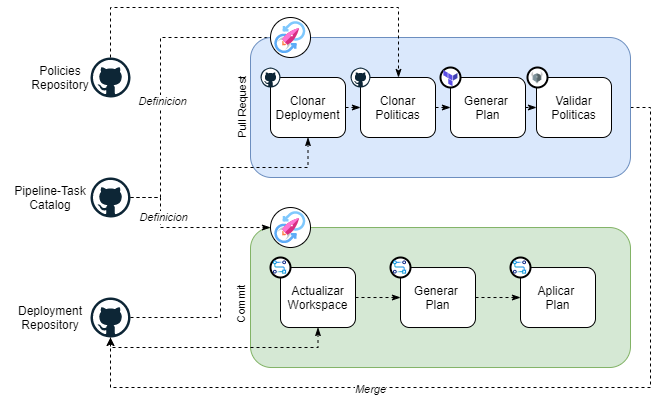

### Flujo
---

Este flujo simulará la interacción de un pipeline con repositorios gestionados por diferentes roles dentro de la organización.

* Las politicas serán gestionadas por un ingeniero de seguridad en su propio repositorio.
* Los pipelines serán gestionados por un ingeniero devops en un repositorio que funcionará como catalogo.
* La plantilla de Terraform será gestionada por un desarrollador o ingeniero devops en un repositorio diferente.

El flujo consiste en lo siguiente:

1. Las plantillas de Terraform se desarrollan dentro de la rama dev, cuando se desea desplegar estas, se hace un pull request hacia la rama master.

2. El pull request lanzará un pipeline de IBM Continuous Delivery.

3. El pipeline clonará los repositorios de deployment y de politicas.

4. El pipeline generará el plan de terraform de forma local y lo exportará como JSON

5. El pipeline utilizará Conftest para validar que el plan cumpla con las políticas definidas.

6. Si el plan cumple con las políticas, se hará un merge hacia la rama master, y se generará un commit.

7. El commit lanzará otro pipeline de IBM Continuous Delivery.

8. El pipeline utlizará el CLI de IBM Cloud para actualizar el workspace de IBM Schematics, Generar el plan y finalmente desplegarlo.

### Arquitectura

Los recursos que va a desplegar con IBM Schematics serán los siguientes:

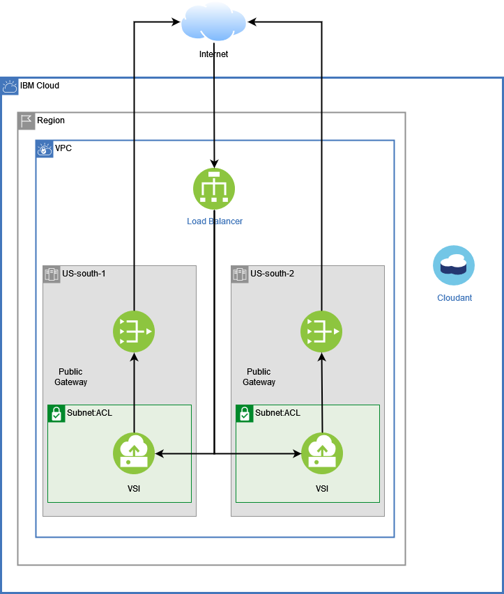

    1 VPC.
    2 Subnets.
    2 Public Gateways.
    1 Public Load Balancer.
    1 Security Group
    1 Instance group para manejar las instancias.
    1 Instancia de Cloudant


### Política como código y Rego
---

Las políticas como código consisten en la idea de escribir codigo en alto nivel para manejar y automatizar el cumplimiento de politicas.

Cada organizacion prueba sus productos antes de entregarlo a sus consumidores. En lo que respecta al desarrollo de software cada organización tiene sus prácticas, herramientas y procesos para verificar la salud, disponibilidad y precisión de una aplicación. Esto permite que los cambios esten en cumplimiento y se adhieran a un conjunto de estándares definidos.

Rego es un lenguaje inspirado en Datalog, un lenguaje de consulta para datos estructurados con la diferencia de que Rego incluye JSON.

Las consultas de Rego funcionan como afirmaciones sobre los datos estructurados. Estas consultas se pueden utilizar para definir politicas para enumerar las instancias de datos que violan el estado esperado del sistema.

Para datos especificos sobre la sintaxis de Rego, consulte la [guia de Rego](https://www.openpolicyagent.org/docs/latest/policy-language/).

### OPA y Conftest
---

Open Policy Agent (OPA) es un motor de políticas de codigo abierto creado por [Styra](https://www.openpolicyagent.org/) y graduado por la Cloud Native Computing FOundation.

OPA toma decisiones de políticas utilizando las consultas que toman como input la data y las políticas.

Conftest por otro lado es una herramienta de linea de comando para probar archivos de configuracion que internamente utiliza OPA y resulta bastante amigable para utilizarlo en un pipeline de integración continua.

Para mas información sobre Conftest, consulte el siguiente [enlance](https://www.conftest.dev/)


### Politicas
---

En este code pattern las politicas se encuentran de la carpeta [RegoPolicies](./RegoPolicies).

Dentro de esa carpeta encontrará una carpeta policies donde se encuentran las políticas y utilitarios agrupados en carpetas.

El archivo main.rego funciona como agrupador de todas las politicas que se encuentran dentro de la carpeta policies. Si desea agregar politicas nuevas solo tiene que colocarlas en las carpetas existentes o crear una nueva carpeta y agregar el nombre en el arreglo applicable policies.

```rego
applicable_policies := [
    "vpc",
    "cloudant"
]
```

Las politicas existentes validan lo siguiente:

| Namespace      | Politica       |
| ----------- | ----------- |
| VPC        | Se puede usar cualquier CIDR menos el 0.0.0.0/0.        |
| VPC | No se puede usar el recurso public gateway.        |
| CLOUDANT        | La base de datos debe estar asignada a un resource group explicitamente.|
| CLOUDANT         | La base de datos requiere los tags Owner, Proyecto y Entorno.  |
| CLOUDANT         | Los tags deben tener el formato Key:Value.  |
| CLOUDANT         | La base de datos solo debe tener una credencial del tipo writer.  |

### Sintaxis de Rego
---

En Rego las políticas son definidas en módulos, cada módulo consiste en:

* Una declaraciín Package para grupar las reglas definidas en un namespace.
* Cero o mas Imports para establecer dependencia con otros modulos
* Cero o mas Rules

Para mas información sobre los modulos haga click [aqui](https://www.openpolicyagent.org/docs/latest/policy-language/#modules)

Tome como ejemplo el archivo [vpc.rego](./RegoPolicies/policies/vpc/vpc.rego)

Dentro de vpc.rego incluimos el nombre del Package

```rego
package main
```

La primera regla que se va a crear va a servir para denegar el uso del cidr 0.0.0.0/0 en los security groups con el fin de no permitir el tráfico desde o hacia internet.

Primero se define una constante con todos los cidrs que se van a denegar:

```rego
invalid_cidrs = [
  "0.0.0.0/0",
]
```

Debido a que en Rego no existe una función para validar si un elemento existe dentro de un arreglo, deberá crearla usted mismo. Para realizar una iteración en Rego no se utiliza una palabra reservada como for o foreach, solo se debe tomar la colección que se desea iterar y entre los [] se debe colocar una variable como i,j o si no tiene variables de ese tipo puede usar el simbolo _.

```rego
array_contains(arr, elem) {
  arr[_] = elem
}
```

La regla se escribe de la siguiente forma:

```rego
deny[reason] {
  changeset := input.resource_changes[_]
  changeset.type == "ibm_is_security_group_rule"
  cidr := changeset.change.after.remote
  direction := changeset.change.after.direction
  array_contains(invalid_cidrs,cidr)
  reason := sprintf(
              "%-40s :: security group invalid %s CIDR %s",
              [changeset.address,direction,cidr]
            )
}
```

Esto no es una función, si compara con el caso anterior verá que esta utilizando [] en ves de (). Una diferencia clave es que la regla no toma parámetros, en vez de referirse a ellos como argumentos o parametros se les llama objetos. En este caso el objeto **reason** sera utilizado como output. Las reglas devuelven un grupo de objetos que puedan satisfacer todas las sentencias.

En la regla, primero se itera la colección resource_changes del JSON del plan de terraform. Esta colleccion contiene todos los recursos de terraform que sean manipulados segun el plan. Luego, se valida si cada elemento de la coleccion es del tipo **ibm_is_security_group_rule** ya que ese es el recurso que tiene la configuración que desea validar.

A continuación, se realizan dos asignaciones:

* El valor del campo remote del recurso a la variable cidr
* El valor del campo direction del recurso a la variable direction

Finalmente, se valida si el cidr del recurso existe en el arreglo de cidrs inválidos utilizando la funcion **array_contains** y se asigna un mensaje utilizando las variables del objeto que no cumple con la política asignadolo al objeto reason.

Si desea probar el funcionamiento de su politica puede hacerlo en [Rego Playground](https://play.openpolicyagent.org), solo debe copiar el JSON de Terraform en la sección INPUT y su código en Rego en la sección principal.

Al momento de evaluar su política deberia recibir lo siguiente:

```JSON
"deny": [
        "ibm_is_security_group_rule.inbound-http  :: security group invalid inbound CIDR 0.0.0.0/0",
        "ibm_is_security_group_rule.outbound-dns  :: security group invalid outbound CIDR 0.0.0.0/0",
        "ibm_is_security_group_rule.outbound-http :: security group invalid outbound CIDR 0.0.0.0/0",
        "ibm_is_security_group_rule.outbound-https :: security group invalid outbound CIDR 0.0.0.0/0"
]
```

### Pasos
---
1. Clone el repositorio
2. Distribuya el contenido en 3 nuevos repositorios
3. Cree un workspace de IBM Schematics
4. Configuración del Toolchain
5. Configure el Pipeline para los Pull Requests
6. Configure el Pipeline para los commits
7. Interactue con el Flujo

### 1. Clone el repositorio
---

```bash
git clone https://github.com/IBM/XXXXXXXXX.git
```

### 2. Distribuya el contenido en 3 nuevos repositorios
---

```sh
cd Repositorio
rm -rf .git
cd Deployment
git init
git remote add origin <git deployment repository>
git commit --allow-empty -m "root commit"
git push origin master
git checkout -b dev
git add *
git commit -m "First Deployment Commit"
git push origin dev
cd ../RegoPolicies
git init
git remote add origin <git policies repository>
git add *
git commit -m "First Policies Commit"
git push origin master
cd ../TektonCatalog
git init
git remote add origin <git catalog repository>
git add .tekton
git commit -m "First Catalog Commit"
git push origin master
```

### 3. Cree un workspace de IBM Schematics
---

Para crear el workspace debe tener lo siguiente:

* Una cuenta de [IBM Cloud](http://ibm.biz/max-contents)
* Tener instalada la versión 2.0 o superior de [IBM Cloud CLI](https://cloud.ibm.com/docs/cli?topic=cloud-cli-install-ibmcloud-cli). Consulte [estas instrucciones](https://cloud.ibm.com/docs/cli?topic=cloud-cli-install-ibmcloud-cli#update-ibmcloud-cli) sobre cómo saber qué versión tiene instalada y cómo actualizarla.
* Si el repositorio de Deployment es privado, necesitara generar un [token](https://docs.github.com/en/github/authenticating-to-github/keeping-your-account-and-data-secure/creating-a-personal-access-token)

En su cuenta de IBM Cloud vaya a Schematics y en la seccion workspace haga click en el boton **Create Workspace**.

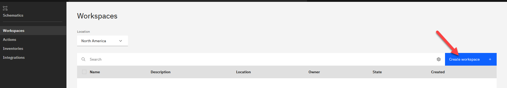

Ingrese la ruta del repositorio donde esta el archivo .tf que va a ejecutar. Es importante que la ruta tenga el formato \<url_git\>/tree/\<branch\>/\<path\>.

Si su repositorio es privado pegue el token que genero.

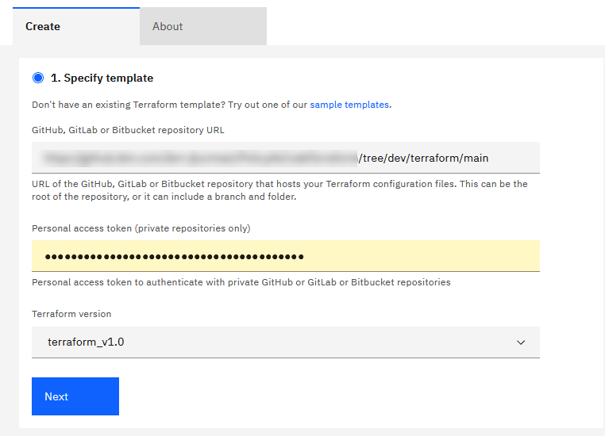

Ingrese un nombre para su workspace y haga click en el boton Create

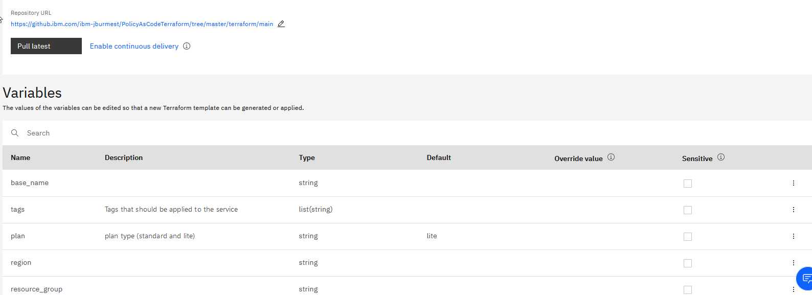

Como resultado debería poder ver la lista de variables que se solicitan. Estas variables son cargadas desde el archivo [variables.tf](./Deployment/terraform/main/variables.tf).

Deberá editar las variables con los valores establecidos en el archivo [variables.tfvars](./Deployment/terraform/main/variables.tfvars). Para editar una variables haga click en el boton del extremo derecho y haga click en el boton **Edit**.

El resultado debería ser similar al siguiente:

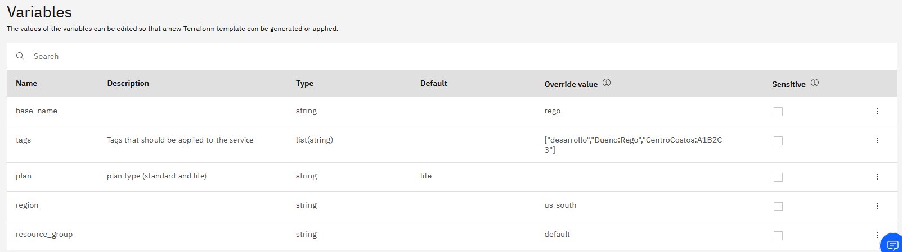

### 4. Configuracion del Toolchain
---

#### Configuracion de Repositorio

En la pantalla de configuracion del workspace haga click en el enlace **Enable continuous delivery**

En el wizard de configuración coloque un nombre para el toolchain. Seleccione el proveedor donde cargo el código y haga click en el boton **Authorize**.

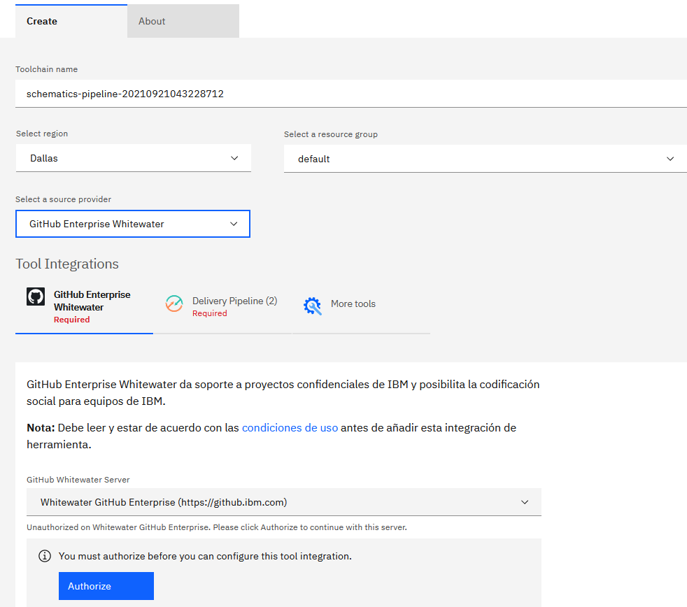

Una vez que el proveedor este autorizado, se le solicitará validar los datos del repositorio que va a desencadenar los pipelines. En este caso, por defecto es el mismo repositorio que indicó en el workspace de Schematics. Para este caso no es necesario que habilite Github Issues o el seguimiento del despliegue de cambios de código.

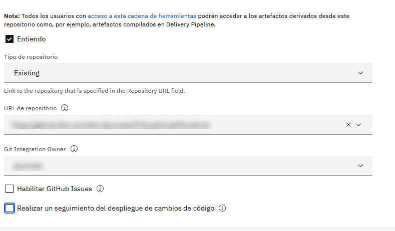

#### Configuracion de Delivery Pipeline

En la pestaña delivery pipeline, cree una nueva API Key haciendo click en el boton new o puede reutilizar si cuenta con una. Se recomienda habilitar la opción para guardar el key en un almacén de secretos para que se pueda reutilizar en el futuro.

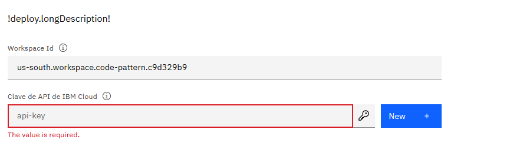

Al hacerlo se le solicitarán datos para crear una instancia de IBM Key Protect.

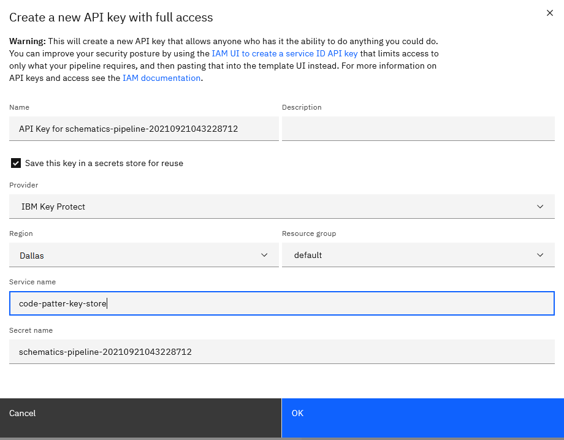

En la sección Tekton Definitions, en la configuración de schematics-pipeline, seleccione el repositorio de catálogo existente. Debe realizar lo mismo con la configuración de tekton-catalog.

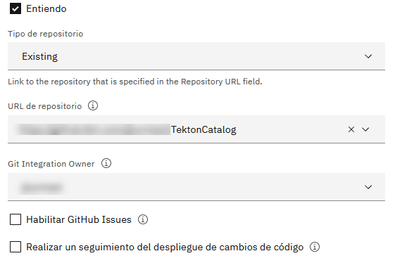

Finalmente haga click en el boton **Create**.

## 5. Configure el Pipeline para los Pull Requests
---

### Definicion del Pipeline

El toolchain quedo de la siguiente manera:

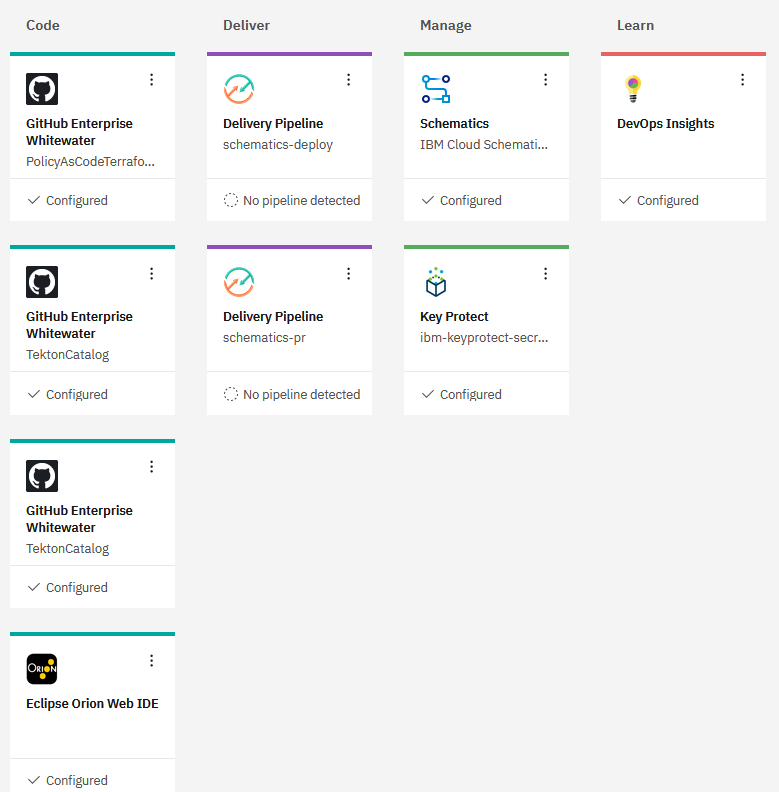

Debido a que en este caso, el catálogo de tareas del pipeline y la definición del pipeline se encuentran en el mismo repositorio tiene una configuración duplicada. Aproveche esa configuración duplicada y cámbiela para que apunte al repositorio de políticas.

Haga click en el icono de tres puntos y seleccione configure.

En la configuración seleccione el repositorio de politicas y haga click en el boton **Save Integration**.

Ahora, haga click sobre el icono de schematics_pr. En la seccion Definition borre todas las configuraciones haciendo click en el icono de tres puntos y seleccionando remove.

Luego, haga click en el boton add, seleccione el repositorio de catalogo y la ruta ingresar:

```sh
.tekton/tasks/git
```

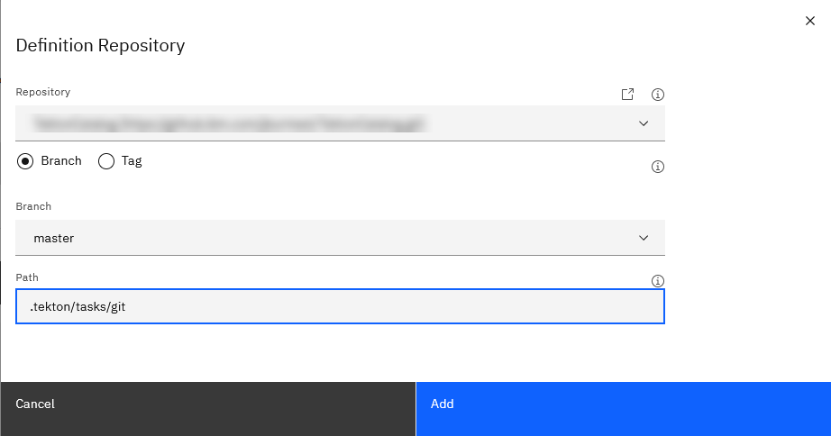

Repita el paso anterior para agregar configuraciones a las siguientes rutas:

```sh
.tekton/tasks/rego
.tekton/pipeline/pr
```

La configuracion debería quedar de la siguiente forma:

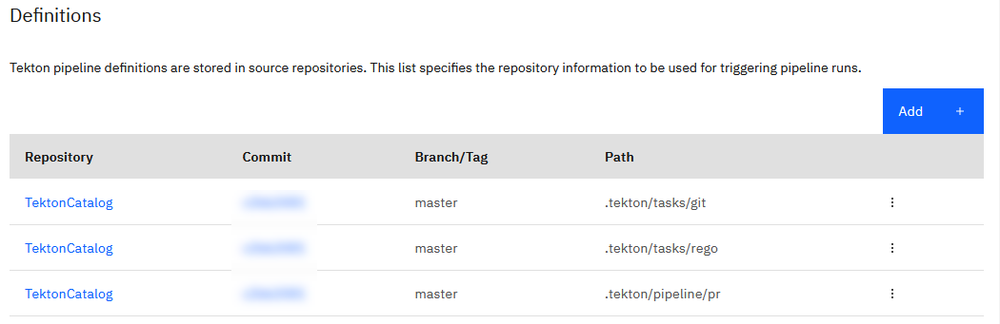

Haga click en el boton **Save** en la parte inferior de la página.

### Configuracion de Trigger

En la seccion Trigger, en el campo listener seleccione github-ent-pr-listener si sus repositorios están en un github enterprise o github-pr-listener si sus repositorios están en github.com.

Haga click en el boton **Save** en la parte inferior de la página.

### Configuración de Variables de Entorno

En la sección Environment Properties agregue las siguientes variables de entorno haciendo click en el boton add

| Nombre      | Valor       |
| ----------- | ----------- |
| WORKSPACE_ID        | *Se obtiene en la ventana de configuracion del workspace de Schematics        |
| policies-repository | *URL del repositorio de politicas        |
| policies-dir        | rego|
| tf-var-file         | variables.tfvars  |

La configuración deberia quedar de la siguiente forma:

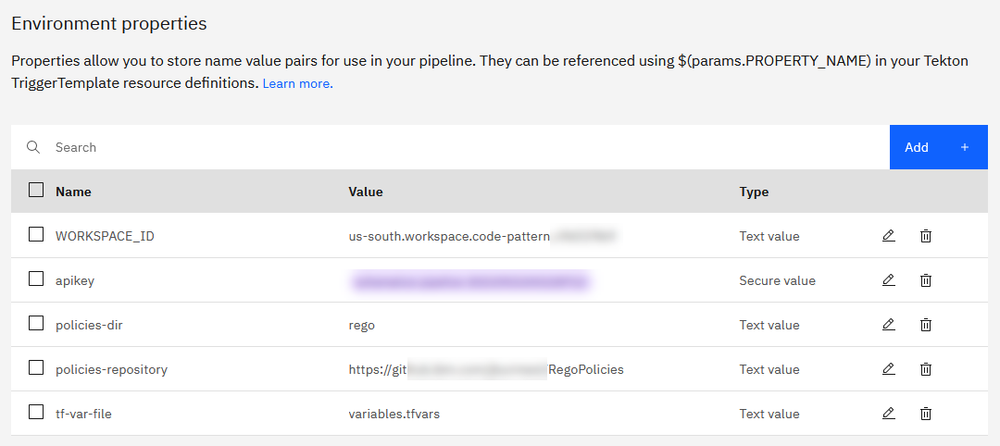

En la seccion Workers seleccione Tekton Pipelines v.0.27.X

## 6. Configure el Pipeline para los commits
---

### Definicion del Pipeline

De la misma forma que con el pipeline anterior, esta vez en el toolchain haga click sobre el pipeline schematics-deploy.

En la sección Definitions agregue las definiciones de las siguientes rutas:

```sh
.tekton/pipeline/ci
.tekton/tasks/schematics
```

Haga click en el botón **Save** en la parte inferior de la página.

### Configuracion de Trigger

En la sección Triggers en el Trigger **Git Trigger - Commit**, en el campo Branch seleccione master.

En el campo listener seleccione github-ent-ci-listener si sus repositorios están en un github enterprise o github-ci-listener si sus repositorios están en github.com.

Eliminar el Trigger **Manual Trigger** haciendo click en el icono de basurero al costado del nombre.

Haga click en el botón **Save** en la parte inferior de la página.

### Configuracion de Variables de Entorno

En la sección Environment Properties agregue las siguientes variables de entorno:

| Nombre      | Valor       |
| ----------- | ----------- |
| WORKSPACE_ID        | *Se obtiene en la ventana de configuracion del workspace de Schematics        |


## 7. Interactue con el Flujo
---

### Creacion del Pull Request

En el repositorio de Deployment haga un pull request desde dev hacia master.

El pull request deberá lanzar la ejecución del pipeline pr:

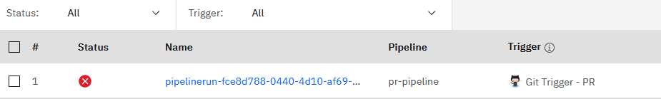

Al ingresar al pipeline podemos ver la lista de tareas:

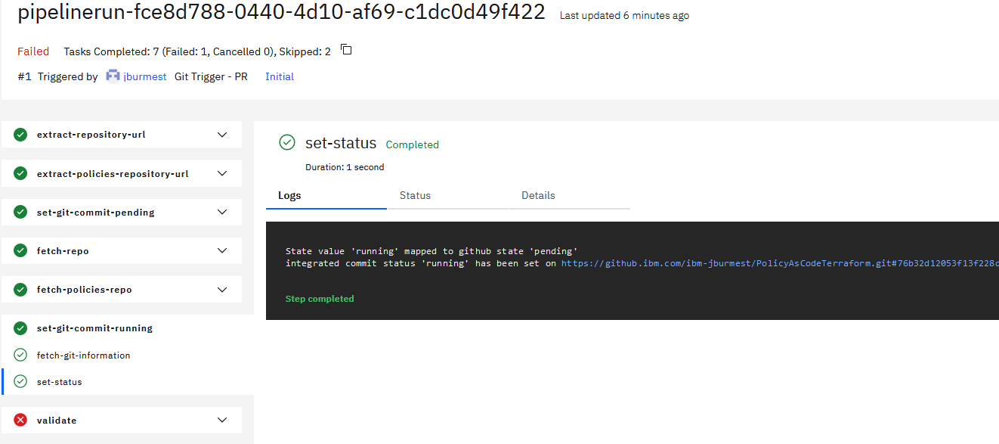

Si va a la tarea validate podrá ver que se produce un fallo porque el deployment no cumple con las politicas:

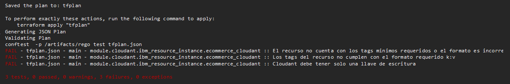

### Correcciones

Para simular una corrección realice lo siguiente:

1. Renombre o borre el archivo [main.tf](./Deployment/terraform/cloudant/main.tf) de su repositorio de Deployment en la carpeta terraform/cloudant.
2. Renombre el archivo [main.tf.fixed](./Deployment/terraform/cloudant/main.tf.fixed), de su repositorio de Deployment en la carpeta terraform/cloudant, a main.tf
3. Renombre o borre el archivo [variables.tfvars](./Deployment/terraform/main/variables.tfvars) de su repositorio de Deployment en la carpeta terraform/main.
4. Renombre el archivo [variables.tfvars.fixed](./Deployment/terraform/main/variables.tfvars.fixed), de su repositorio de Deployment en la carpeta terraform/main, a variables.tfvars
5. En el workspace de schematics corrija los valores de las variables según lo indicado en el nuevo archivo variables.tfvars
6. En el repositorio de Deployment haga un commit y push a la rama dev

```sh
git add *
git commit -m "Correcciones"
git push origin dev
```

Con las correcciones, esta vez se cumple con las políticas y el pipeline finaliza correctamente.

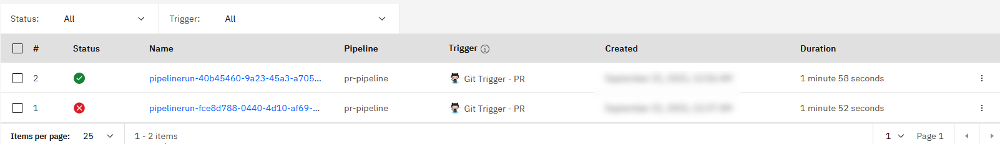

### Merge

Al momento de hacer el merge con la rama master se lanza el pipeline schematics deploy:

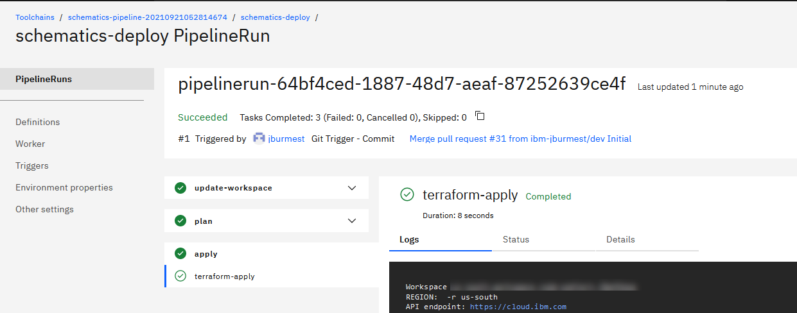

Como el pipeline termina de forma correcta, si va a su workspace vera que los recursos se han creado:

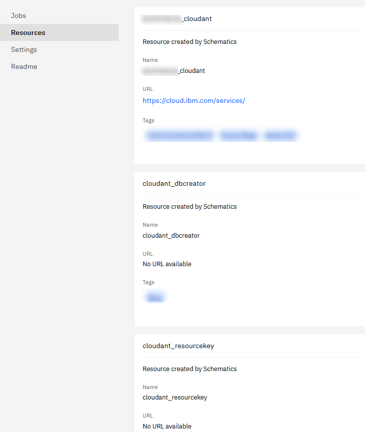


