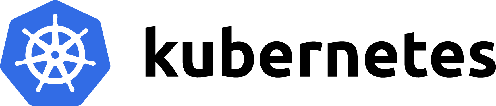

# Kubernetes

En esta sección podrás encontrar todo el contenido relacionado a Kubernetes.

Kubernetes es una plataforma de orquestación de contenedores de código abierto que automatiza la implementación, la administración y el escalado de aplicaciones. Para más información, consulta [nuestro artículo "What is Kubernetes?"](https://www.ibm.com/cloud/learn/kubernetes).

# Índice de Contenidos

- **Tutoriales**
  - [Coming Soon!]()
- **Code Patterns**
  - [Coming Soon!]()

# Contribuciones

Para más información sobre cómo contribuir a este repositorio, dirígete a [la sección de contribuciones](docs/CONTRIBUITING.md).