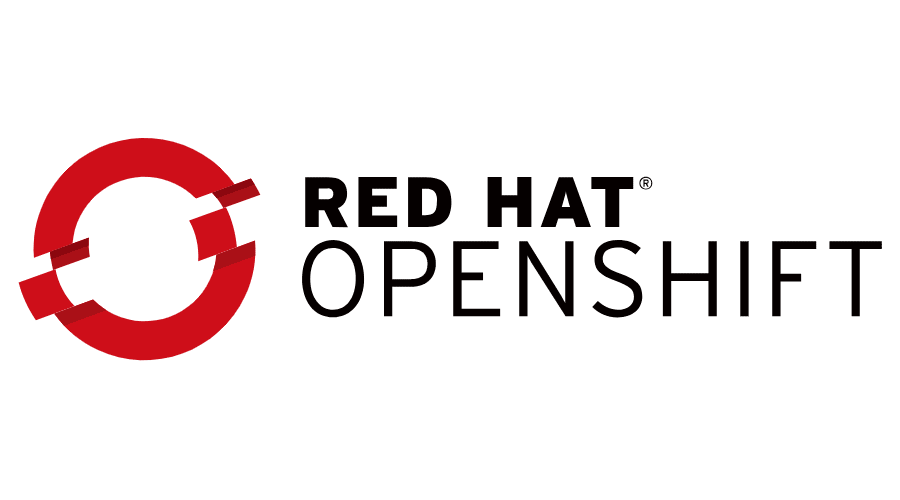

# Kubernetes

En esta sección podrás encontrar todo el contenido relacionado a Red Hat OpenShift (RHOS).

Red Hat OpenShift es una plataforma de aplicaciones de contenedores de código abierto basada en el orquestador de contenedores de Kubernetes para el desarrollo y la implementación de aplicaciones empresariales. Para más información, consulta [el sitio oficial de OpenShift](https://www.openshift.com/).

## Índice

- [Coming Soon!]()

## Contribuciones

Para más información sobre cómo contribuir a este repositorio, dirígete a [la sección de contribuciones](../../../docs/CONTRIBUITING.md).

## Navegación

- [↗ Volver al Índice](../../../README.md)