# Integre Instana con una aplicación de microservicios en OpenShift

[Code Pattern Original en IBM Developer (Inglés)](https://developer.ibm.com/patterns/integrating-instana-with-microservice-app-on-openshift/)

## Introducción

En este patrón de código, integraremos [Instana](https://www.instana.com/) con una aplicación de viajes de microservicio políglota en OpenShift. Instana es una solución de Observabilidad Empresarial totalmente automatizada, con supervisión de la infraestructura y Gestión del Rendimiento de las Aplicaciones (APM), diseñada específicamente para los desafíos de la gestión de aplicaciones nativas de la nube y de microservicios. 

Generaremos tráfico a la aplicación usando [Puppeteer](https://developers.google.com/web/tools/puppeteer/) ahí analizaremos el tráfico en el panel de Instana. La aplicación de viaje utilizada en este patrón de código es parte del proyecto [Bee Travels](https://bee-travels.github.io/) que se centra en algunos de los servicios de la primera versión de la aplicación. Los servicios incluidos en este Code Pattern  son:

* Destination v1 (Node.js)
* Car Rental v1 (Node.js)
* Hotel v1 (Python)
* Currency Exchange (Node.js)
* UI (Node.js/React)

### Requisitos previos

* [IBM Cloud account](https://cloud.ibm.com/registration)
* [OpenShift CLI (oc)](https://cloud.ibm.com/docs/openshift?topic=openshift-openshift-cli#cli_oc)
* [Docker](https://www.docker.com/products/docker-desktop)
* [NodeJS](https://nodejs.org/en/download/)
* [NPM](https://www.npmjs.com/get-npm)
* [Yarn](https://classic.yarnpkg.com/en/docs/install)
* [Pupeteer](https://developers.google.com/web/tools/puppeteer/get-started)
* [Acceso a Instana](https://www.instana.com/trial/)

## Flujo

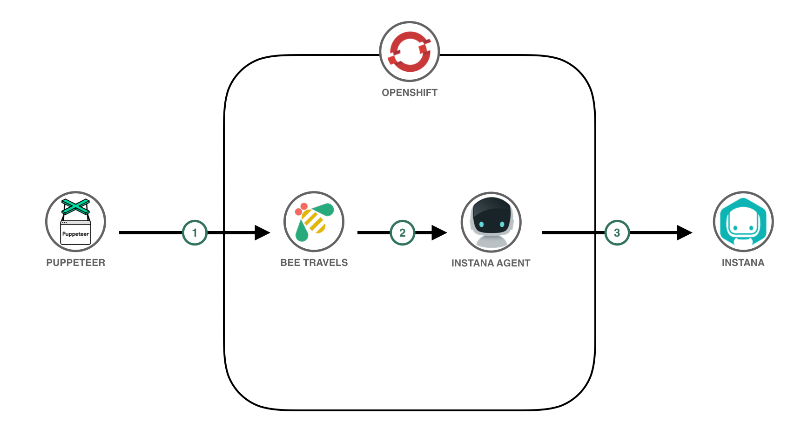

1. El script Puppeteer genera tráfico a la aplicación Bee Travels que se ejecuta en el clúster de OpenShift.
2. El código Instana en cada servicio de la aplicación Bee Travels envía datos sobre cada servicio respectivo al Agente Instana en el clúster de OpenShift (un Agente Instana por nodo del clúster).
3. El Agente Instana envía esos datos a su cuenta en Instana, donde puede analizar / monitorear los microservicios de Bee Travels a través del panel de Instana.

## Secuencia

1. [Requisitos previos](#requisitos-previos)
2. [Integrar Instana](#1-integrar-instana)
3. [Deploy to OpenShift](#2-implementar-en-openshift)
4. [Genere tráfico y analícelo con Instana](#3-genere-tráfico-y-analícelo-con-instana)

## Pasos a seguir

### 0. Haz Fork del repositorio

Deberás descargar una copia local de este repositorio, sea clonándolo o realizando un `fork`.

### 1. Integrar Instana

Una vez que tengan acceso a Instana, abran el panel de Instana. Presionen  `Add Website` e ingresen un nombre para su sitio web ej. `Bee Travels`

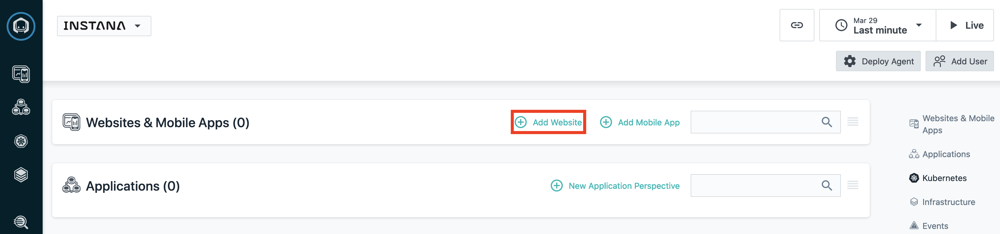

Copien el script generado e insértenlo en la`<head>` etiqueta de [/source/src/services/ui/frontend/public/index.html](source/src/services/ui/frontend/public/index.html). Esto integra Instana en la interfaz de usuario de la aplicación. Esto ahora les permitirá analizar las cargas de la página, el tráfico y más en la parte frontal de la aplicación.

Instana ya está integrado en los servicios. Para aprender a integrar Instana con sus propios servicios, se proporciona documentación para integrar Instana en aplicaciones [Node.js](https://www.instana.com/docs/ecosystem/node-js/configuration/) y [Python](https://www.instana.com/docs/ecosystem/python/configuration/), así como [muchas otras tecnologías](https://www.instana.com/docs/ecosystem/). Tener Instana en los servicios de backend permite que los rastreos distribuidos, la telemetría y otra información sobre las llamadas realizadas a un servicio se envíen a Instana. Además, puede analizar las llamadas de rastreo individuales para mostrar cómo se comunican sus servicios entre sí. Puede ver cómo se integra Instana en cada servicio de Bee Travels aquí yendo a lo siguiente:

**Servicio de destino**
* Código fuente: [source/src/services/destination-v1/src/app.js](source/src/services/destination-v1/src/app.js) (líneas 14-17)
* Yaml de despliegue: [source/config/destination-v1-deploy.yaml](source/config/destination-v1-deploy.yaml) (líneas 53-64)

**Servicio de alquiler de coches**
* Código fuente: [source/src/services/car-rental-v1/src/app.js](source/src/services/car-rental-v1/src/app.js) (líneas 15-18)
* Yaml de despliegue: [source/config/carrental-v1-deploy.yaml](source/config/carrental-v1-deploy.yaml) (líneas 53-64)

**Servicio de hotel**
* Código fuente:  [source/src/services/hotel-v1-python/app/\__init__.py](source/src/services/hotel-v1-python/app/__init__.py) (líneas 11-12, 28)
* Yaml de despliegue: [source/config/hotel-v1-python-deploy.yaml](source/config/hotel-v1-python-deploy.yaml) (líneas 53-64)

**Servicio de cambio de moneda**
* Código fuente: [source/src/services/currency-exchange/src/app.js](source/src/services/currency-exchange/src/app.js) (líneas 14-17)
* Yaml de despliegue: [source/config/currencyexchange-deploy.yaml](source/config/currencyexchange-deploy.yaml) (líneas 51-62)

Ahora que Instana se ha incorporado al código, ahora estamos listos para obtener las credenciales para implementar un Agente Instana. Para hacer esto, desde el panel de Instana presionen `Deploy Agent`

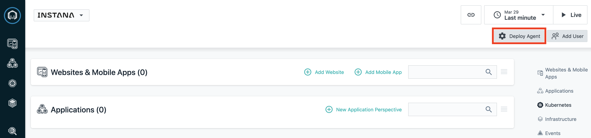

Luego, seleccionen `OpenShift` como plataforma y `Operator` como tecnología y copien `Instana Service Endpoint`, `Instana Service port` e `Instana Application Key`. Estos seran necesarios para desplegarlo en el OpenShift cluster.

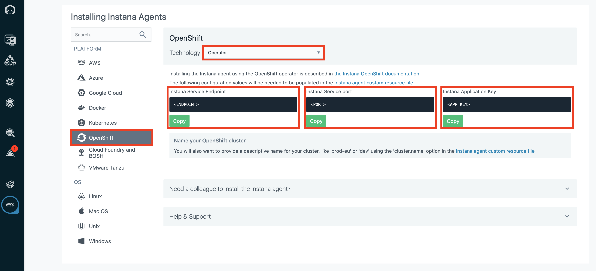

### 2. Implementar en OpenShift

1. Aprovisionen un [clúster de OpenShift](https://cloud.ibm.com/kubernetes/catalog/create?platformType=openshift).
> NOTA: Este paso puede tardar unos 30 minutos.

2. Abran la consola de OpenShift y copien / peguen su comando de inicio de sesión ( `oc login...`) en una ventana de terminal.

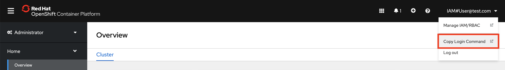

3. Desde la ventana de la terminal, ejecuten el `build-and-deploy.sh` script para crear la aplicación Bee Travels e implementarla en su clúster de OpenShift.
> NOTA: Este paso puede tardar unos minutos.

```
cd instana-openshift
./build-and-deploy.sh -d <DOCKERHUB_USERNAME>
```

Una vez que se completa el script, pueden verificar que los servicios de la aplicación se estén ejecutando en su clúster de OpenShift yendo a `Workloads` -> `Pods` en sus consola de OpenShift. Además, verifiquen que está en el proyecto `bee-travels` recién creado . Debería tener el siguiente aspecto:

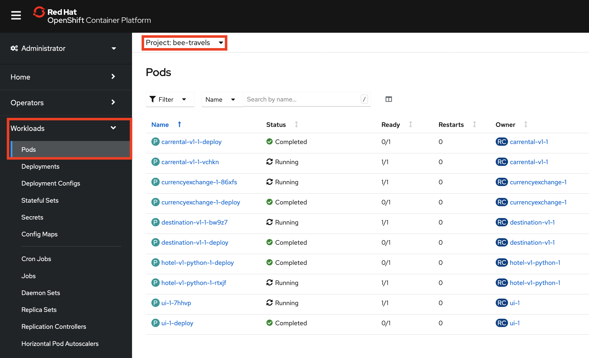

4. Ahora que los servicios de la aplicación están implementados en sus clústers de OpenShift, es hora de exponer la interfaz de usuario mediante una ruta. Desde la consola de OpenShift, vayan a `Networking` -> `Routes` y presionen el botón `Create Route`.

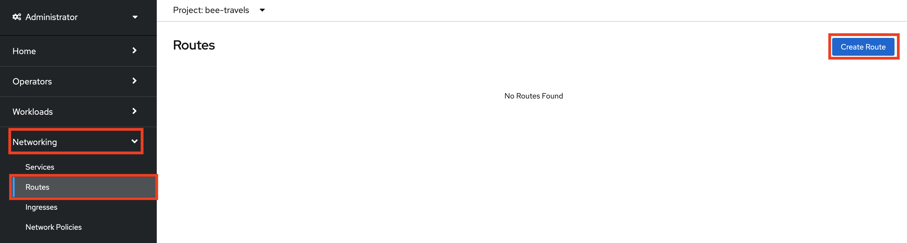

A continuación, completen los campos de la ruta exactamente como en la siguiente captura de pantalla y luego creen la ruta.


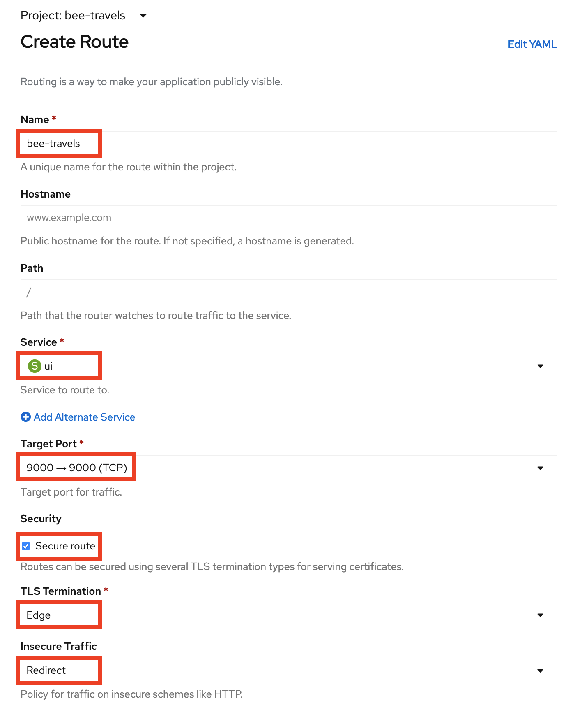

Tomen nota de la ubicación / URL de la ruta recién creada, ya que será necesaria para más adelante.

5. El último paso con el clúster de OpenShift es instalar Instana Agent Operator desde OperatorHub. Primero, deben crear un proyecto para Instana Agent y configurar sus permisos. Desde la ventana de su terminal, ejecuten los siguientes comandos:

```
oc new-project instana-agent
oc adm policy add-scc-to-user privileged -z instana-agent
```

A continuación, vayan a `Operators` -> `OperatorHub` en su clúster de OpenShift y busquen Instana Agent Operator. Verifiquen que están en el proyecto recién creado  `instana-agent`. Instalen el operador.

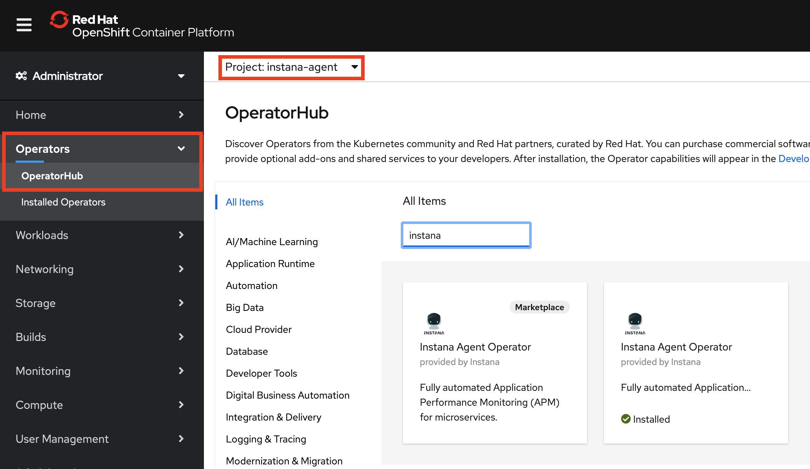

Una vez que el operador esté instalado, creen una instancia de un Agente Instana.

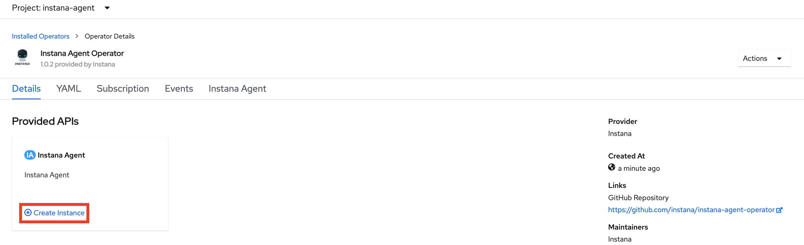

Asegúrense de configurar `YAML view` y editar el YAML para que se vea como la siguiente captura de pantalla. Aquí es donde incorporaremos las credenciales de Instana que se copiaron del paso anterior. `<APP KEY>` se refiere a `Instana Application Key`, `<ENDPOINT>` se refiere a `Instana Service Endpoint`, y `<PORT>` se refiere a `Instana Service port`. Una vez que el archivo YAML esté configurado correctamente, cree la instancia de Instana Agent.


### 3. Genere tráfico y analícelo con Instana

En este punto, deberían comenzar a notar que sus paneles de Instana se llenan con información de sus clústers de OpenShift. Ahora es el momento de comenzar a generar algo de tráfico hacia la aplicación Bee Travels que se está ejecutando en su clúster de OpenShift. Para generar tráfico, usaremos un script que usa [Puppeteer](https://developers.google.com/web/tools/puppeteer/). Desde la ventana de su terminal, ejecuten lo siguiente para generar tráfico:

```
cd traffic
npm install
node traffic.js <NUM_CALLS> <ROUTE>
```

`NUM_CALLS` -se refiere a cuántas llamadas se realizarán a la aplicación Bee Travels. Cada llamada hará 2 solicitudes a la aplicación. Uno será para buscar hoteles para una ciudad aleatoria y el otro será para buscar alquileres de automóviles para la misma ciudad aleatoria.

`ROUTE` - se refiere a la ubicación / url de la ruta creada desde OpenShift. Asegúrate de que no haya seguimiento `/`

Una vez que la secuencia de comandos de tráfico haya terminado de ejecutarse, vayan a su panel de Instana y haga clic en sus sitios web Bee Travels para ver el tráfico. Si no ven tráfico, actualicen sus intervalos de tiempo de visualización en la esquina superior derecha. Una vez que puedan ver el tráfico, pueden presionar `Analyze Page Loads`para ver las llamadas individuales realizadas a la interfaz de usuario del front-end.

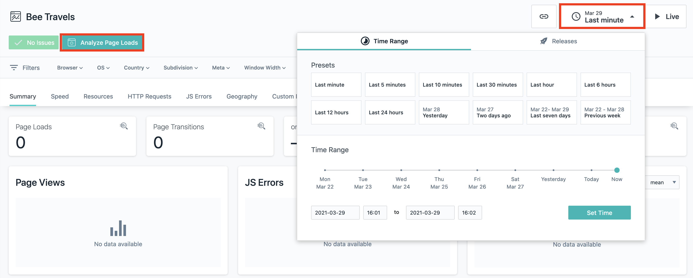

Desde aquí, pueden desplazarse hacia abajo para ver todas las llamadas individuales que se realizaron a la interfaz de usuario de la interfaz. Seleccionen una de las llamadas y hagan clic en la ruta para analizar la llamada individual.

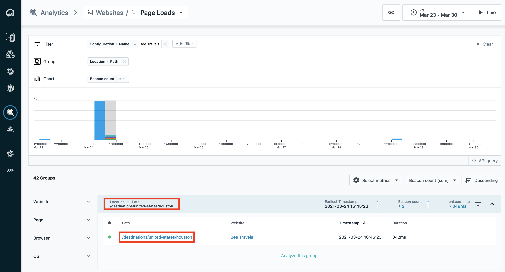

Una vez que estén viendo la llamada individual, desplácense hacia abajo y vean la actividad XHR. Notarán que algunas de las solicitudes tienen un botón `View Backend Trace`. Al hacer clic en el botón, se mostrará un seguimiento de solicitud para un servicio Bee Travels de backend que está siendo llamado por una llamada API desde la interfaz de usuario del front-end.

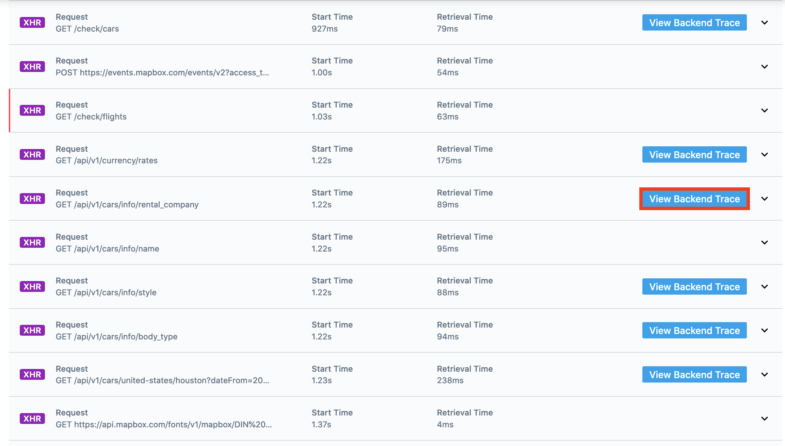

Mientras ven el seguimiento, pueden hacer clic en el servicio del `Service Endpoint List` para analizar ese servicio de backend en Instana.

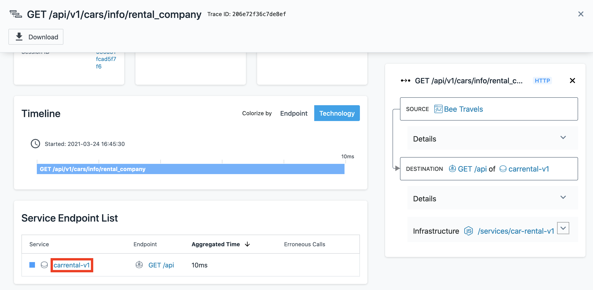

Hasta aquí llega este patrón de código con el análisis de Bee Travels en Instana, pero siéntanse libres de ver más de lo que ofrece Instana en el tablero de Instana.

## Licencia

Este Code Pattern tiene licencia de Apache License, Versión 2. Los objetos de código de terceros independientes invocados dentro de este patrón de código tienen licencia de sus respectivos proveedores de conformidad con sus propias licencias independientes. Las contribuciones están sujetas al  [Developer Certificate of Origin, Version 1.1](https://developercertificate.org/) y la [Apache License, Version 2](https://www.apache.org/licenses/LICENSE-2.0.txt).

[Apache License FAQ](https://www.apache.org/foundation/license-faq.html#WhatDoesItMEAN)
