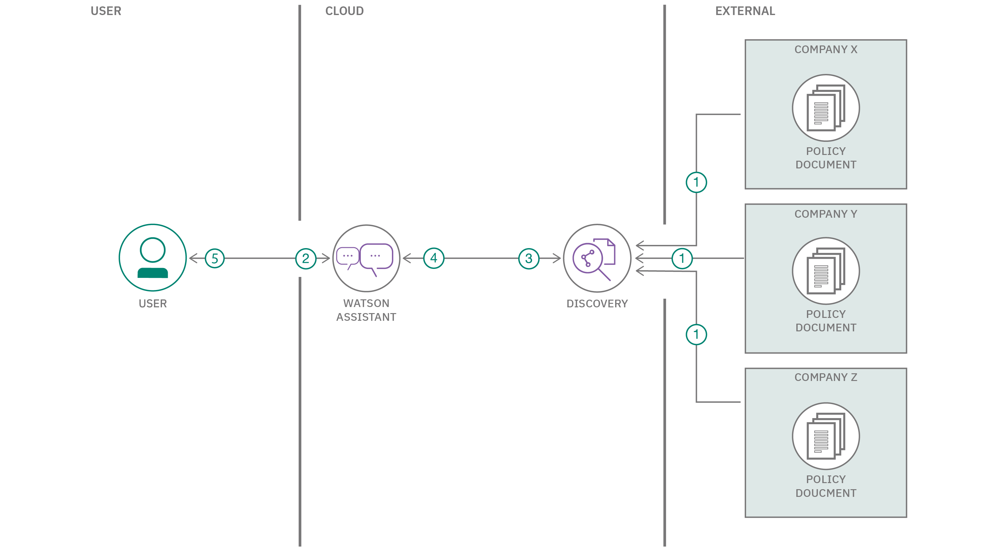
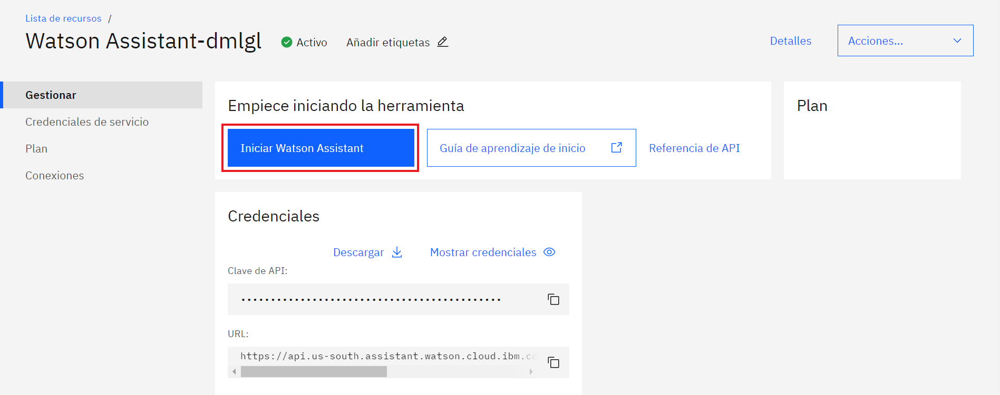
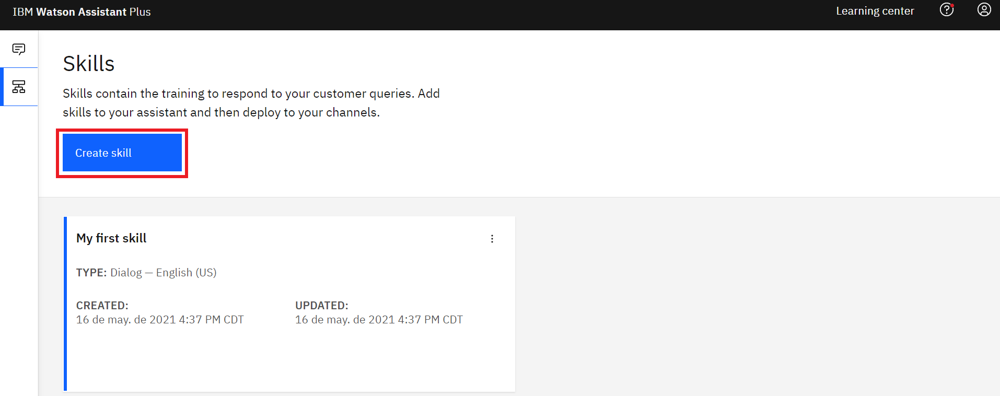
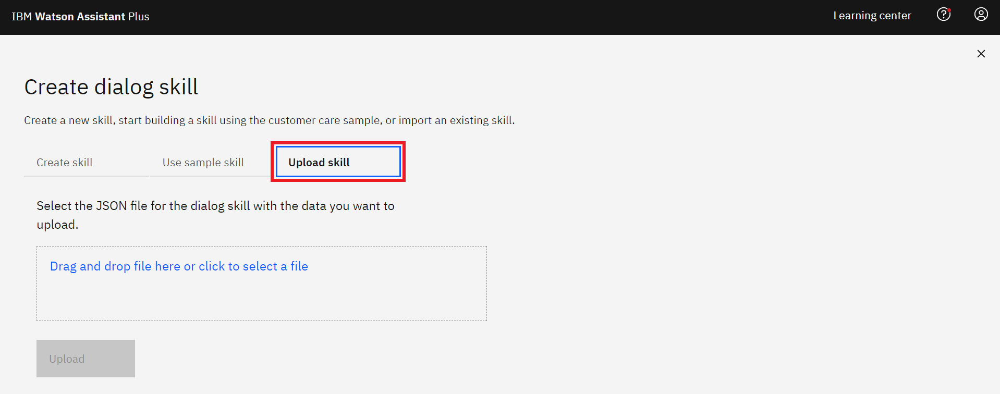
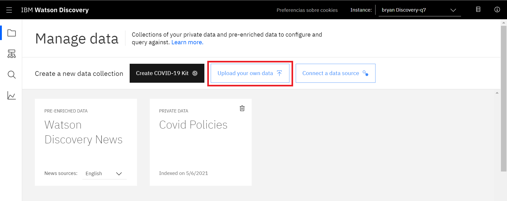
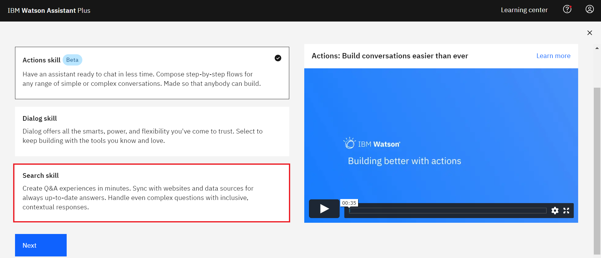
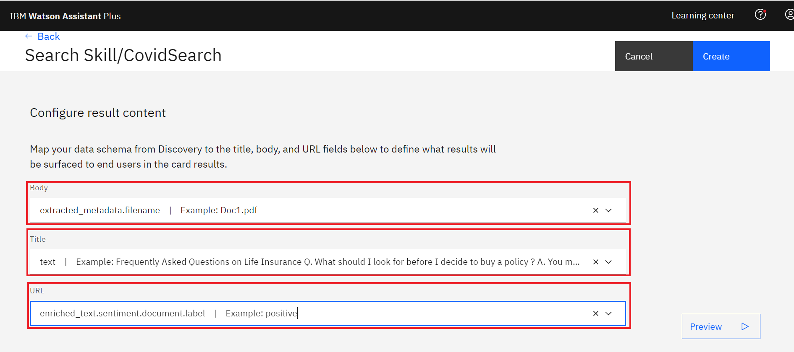
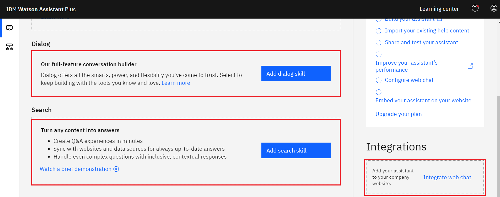
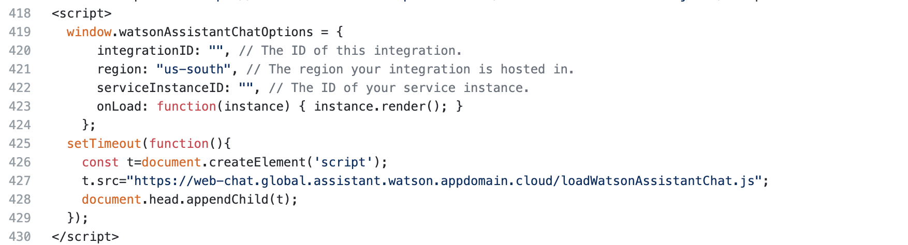

# Cómo crear un chatbot utilizando Watson Assistant y Discovery.

# Introducción
En este tutorial, demostraremos cómo podemos usar **Watson Assistant** con la ayuda de **Watson Discovery** para crear un Chatbot que pueda interactuar con usted acerca de las pólizas de seguro.

**Tiempo estimado:** 1 hora.


# Marco teórico
**¿Qué es un chatbot?**

Un chatbot es un programa que usa IA para llevar a cabo interacciones con humanos usando lenguaje natural en texto y/o audio. Los usuarios pueden hacer preguntas, realizar solicitudes, dar información e interactuar según sus necesidades. Los términos chatbot, asistente virtual y agente conversacional a veces se usan indistintamente, pero los chatbots tienden a admitir conversaciones simples y tareas específicas.
 
**Asistente Watson**

Watson Assistant es un producto de IA de IBM que le permite crear, entrenar e implementar interacciones conversacionales en cualquier aplicación, dispositivo o canal.

**Watson Discovery**

Watson Discovery es una galardonada plataforma de análisis de texto y búsqueda inteligente impulsada por IA que elimina los silos de datos y recupera la información oculta dentro de los datos empresariales. Utiliza un procesamiento de lenguaje natural innovador y líder en el mercado para descubrir información empresarial significativa a partir de documentos, páginas web y big data, lo que reduce el tiempo de investigación en más del 75%.

## Objetivos de aprendizaje
En este tutorial, aprenderá a:

- Crear instancias en IBM Cloud.
- Cargar datos en Watson Discovery.
- Vincular Watson Assistant a Watson Discovery.
- Ejecutar un programa de Python.


## Requisitos previos

- [Cuenta de IBM Cloud](https://www.ibm.com/cloud)

## Flujo
 
 
 
1. Se cargan los documentos en Watson Discovery: Para entrenar el modelo utilizando SDU en varios documentos de política.
2. Watson Assistant interactuará con el usuario para tomar datos personales.
3. Después de recopilar información personal, se inicia la habilidad de búsqueda.
4. Los resultados se obtendrán de Watson Discovery, donde el modelo ha sido entrenado en varios documentos de políticas.
5. Muestre los resultados al usuario.
 ## Secuencia
1. [IBM CLOUD Account.](#1-IBM-Cloud-Account)
1. [Watson Assistant.](#2-Watson-Assistant)
1. [Watson Discovery.](#3-Watson-Discovery)
1. [Assistant Search Skill.](#4-Assistant-Search-Skill)
1. [Edita Flask y Correlo.](#5-Edita-Flask-y-Correlo)


# Pasos a Seguir

## 1. Cuenta de IBM Cloud
- Inicie sesión en [IBM CLOUD](https://cloud.ibm.com/login)

- Si no tiene un **IBMID**, ingrese su dirección de correo electrónico y acepte la casilla de verificación de los términos en la sección Crear una nueva cuenta de IBM Cloud. Luego haga clic en el botón Siguiente para completar el proceso de creación de una nueva cuenta.

## 2. Watson Assistant

1. Cree un nuevo servicio [Watson Assistant Service](https://cloud.ibm.com/catalog/services/watson-assistant).
   1. Seleccione la ubicación más cercana a usted.
   1. En Precios, elija **Trial version**. (No se requiere tarjeta de crédito).
   1. Ingrese el nombre del servicio. Puede optar por ingresar el nombre que desee.
1. Vaya a la lista de IBM Cloud Service y haga clic en la instancia de servicio Watson Assistant creada.
   1. Cuando se abra la página del Asistente, haga clic en **Launch Watson Assistant**
   
  

### 2.1 Habilidad de diálogo
1. En Watson Assistant Haga clic en la **Skill tab** en la barra deslizante.
   1. Haga clic en el botón **Create Skill**.
  
  
   
   1. Seleccione el cuadro **Dialog skill**
   1. Haga clic en el **Next button**.
1. Seleccione la pestaña Importar habilidad.
   1. Haga clic en Elegir **Archivo JSON**.
   1. Busque la carpeta principal del repositorio clonado -> **WA-Skill**.
   1. Seleccione **skill-Covid-Health-Insurance.json** y haga clic en **Open**.

  

## 3. Watson Discovery
1. Cree un nuevo servicio [Watson Discovery](https://cloud.ibm.com/catalog/services/discovery).
   1. Ingrese el nombre del servicio. Puede optar por ingresar el nombre que desee.
   1. Seleccione la ubicación más cercana a usted.
   1. En **Pricing Plans** seleccione el plan **Lite **.
   1. Haga clic en **Create**.
   1. Haga clic en **Launch Watson Discovery**.
  
  

### 3.1 Nueva colección
1. Haga clic en **Upload your own data** asignen un nombre y cargue los documentos de la política en la Carpeta de datos.

  

## 4. Assistant Search Skill
1. Haga clic en **Skills tab** en la barra lateral.
   1. Haga clic en **Create Search skill button**. Y nombrarlo.
  
  
  
2. Seleccione la [Instancia de descubrimiento](#31-Nueva-colección) creada en el paso anterior (sección 3.1). Y elija [DataSet](#3-Watson-Discovery) arriba en la sección 3-1-i.
   1. Haga clic en la [Instancia](#31-Nueva-colección) creada en el paso anterior (sección 3.1), que acaba de crear y configurar la Tarjeta de visualización.
   1. Haga clic en la habilidad creada en el paso 4-1-i, que acaba de crear y configurar la tarjeta de visualización.
  
   
  
3. Haga clic en **Assistant tab** en la barra lateral. Seleccione el Asistente creado y vincule la habilidad de búsqueda creada en [paso 4-1-i](#4-Assistant-Search-Skill)) con este asistente.
    1. Haga clic en Add Integeration en el lado derecho y elija **Web Chat Integeration**  haga clic en **Embed**.
   
  

## 5. Edita Flask y Correlo
1. En la plantilla de repositorio / UI.html, debajo de la línea 418, actualice el ID de integración copiado dentro de la etiqueta de secuencia de comandos.
  

1. Navegue a la carpeta del repositorio clonado
```
pip install -r requirements.txt
```
- Luego correlo
``` 
python app.py
```


# Referencias
 - ["Tutorial - Build an assistant to evaluate various Health Insurance Policies"](https://github.com/IBM/covid_health_insurance_assistance/blob/main/README.md)
 
# Conclusiones
Ahora tienes los conocimientos para crear tu propio Asistente con las tecnologías de IBM. Sabe cómo funciona Watson Assistant y cómo agregar otros servicios de Cloud Pak para datos como Watson Discovery.
# Links de interes
- ["Introducción a IBM Cloud Pak for Data"](https://developer.ibm.com/articles/intro-to-cloud-pak-for-data/)
- ["Idiomas admitidos"](https://cloud.ibm.com/docs/assistant?topic=assistant-language-support)
## Licencia

Este Code Pattern se encuentra licenciado bajo Apache License, Version 2. Objetos de código de terceros invocados en dentro de este Code Pattern se encuentran licenciados bajo sus respectivos proveedores en conformidad con los términos de sus correspondientes licencias. Todas las contribuciones se encuentran sujetas al [Developer Certificate of Origin, Version 1.1](https://developercertificate.org/) y la [Apache License, Version 2](https://www.apache.org/licenses/LICENSE-2.0.txt).

[Preguntas frecuentes sobre Apache License](https://www.apache.org/foundation/license-faq.html#WhatDoesItMEAN)
