# Crea un Chatbot Inteligente en Discord usando APIs de Watson AI
[](https://nodei.co/npm/discord.js/)


## Resumen
En este Code Pattern aprenderás lo sencillo que es integrar diferentes capacidades inteligentes provistas de AI/Machine Learning al construir un chatbot poderoso para usarlo en la plataforma de mensajería y llamadas de Discord, colocándolo en un servidor para clientes y colegas, todo esto mediante la programación sencilla en Node.js. Este chatbot es una muestra de como integrar diferentes recursos de Watson para obtener respuestas inteligentes a diferentes incógnitas.

## Tecnologias

- [Discord.js](https://discord.js.org/#/docs/main/stable/general/welcome)
- [Node.js](https://nodejs.org/en/docs/guides/getting-started-guide/)
- [Natural Language Understanding](https://cloud.ibm.com/docs/natural-language-understanding)
- [Language Translator](https://cloud.ibm.com/docs/language-translator)
- [Tone Analyzer](https://cloud.ibm.com/docs/tone-analyzer)

Tiempo estimado: 30 a 45 minutos.

### Prerequisitos
- Contar con una cuenta de [IBM Cloud](https://cloud.ibm.com/), el plan Lite sirve para este Code Pattern.
- Contar con una cuenta registrada en la plataforma de [Discord](https://discord.com/), se recomienda tener el programa o la aplicación instalada para más rapida ejecución y debug.
- Contar con [Node.js](https://nodejs.org/en/download/) instalado en tu máquina, ya sea Linux, Windows o Mac.
- Contar con [Docker](https://www.docker.com/get-started) instalado en tu maquina, puedes usar también el software de Docker Desktop si es que no tienes muchas experiencia con Docker, aunque para este tutorial no será necesario saber mucho sobre esta tecnología.
- Contar con recursos creados de Natural Language Understanding, Language Translator y Tone Analyzer (técnicamente puedes usar el servicio de Watson que quieras mientras puedas acceder a su API, aunque deberas cambiar el codigo fuente original si es que pruebas otra, los servicios elegidos son a forma de muestra) Si tienes alguna duda de como crear estos servicios visita los enlaces de las tecnologias que están arriba.

## Descripción

El usuario de Discord podrá invitar al bot a un servidor y mediante comandos podrá usar los diferentes recursos inteligentes, como se acostumbra a tratar con los bots de la plataforma. El bot es programado mediante un programa sencillo en Node.js el cual permite ingresar usando permisos mediante el token del bot de Discord, además, el programa realizará llamadas a las APIs de los servicios Watson que nosotros queramos, en este caso, este Code Pattern utilizará varias llamadas a los 3 servicios mencionados previamente: Language Translator, NLU y Tone Analyzer, permitiendo así poder usar el bot como traductor al inglés desde el español, portugués y chino, análisis de emociones extraídos de un texto y la extracción de conocimiento de websites.

## Flow

<p align="center">
  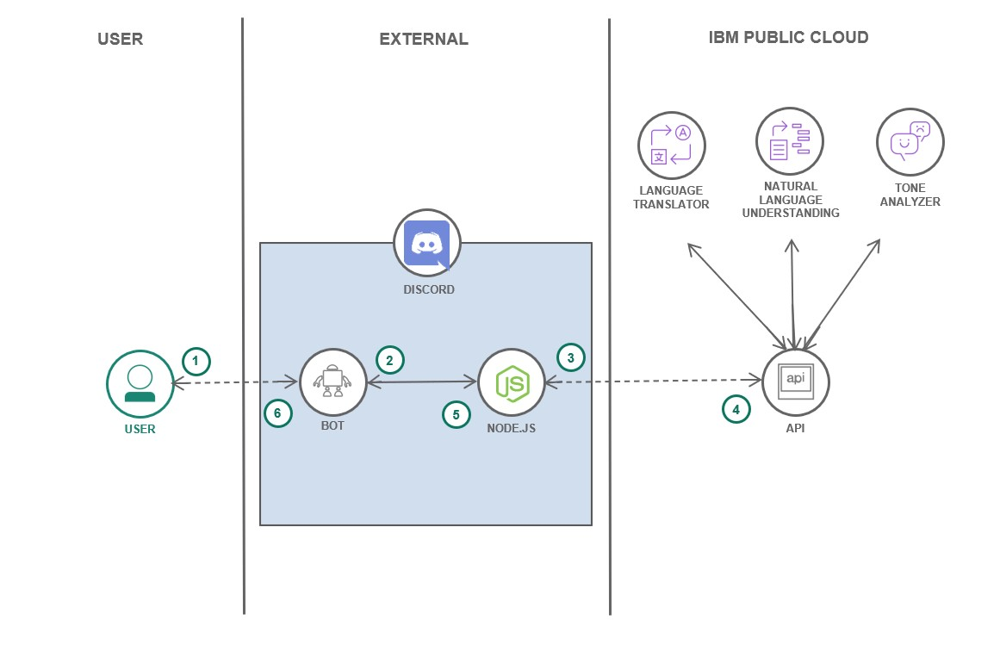</img>
</p>

-	El usuario interactúa con el bot en la plataforma Discord.
-	El bot utiliza la aplicación Node.js para recibir los comandos.
-	Dentro de la app Node.js se realizan las llamadas a la APIs de los servicios.
-	Las respuestas de las APIs son recibidas y acomodadas por la app.
-	El bot entrega las respuestas al usuario en Discord.


## Instrucciones y Pasos

### 1. Registra un nuevo Bot en Discord Developers.

Para crear nuestro bot primero debemos registrar un nuevo bot en el sitio de Discord developers, esto permitirá generar un bot con nombre, descripción e imagen que represente lo que queremos crear, además de darle una entidad dentro de los servidores de Discord, para esto:

Primero, debes dirigirte a [Discord Developer Portal](https://discord.com/developers/applications) e iniciar sesión en el sitio, dentro de este deberías ver una opción para "New Application", haz clic en él como se aprecia en la imagen de abajo recalcado en el círculo rojo.

<p align="center">
  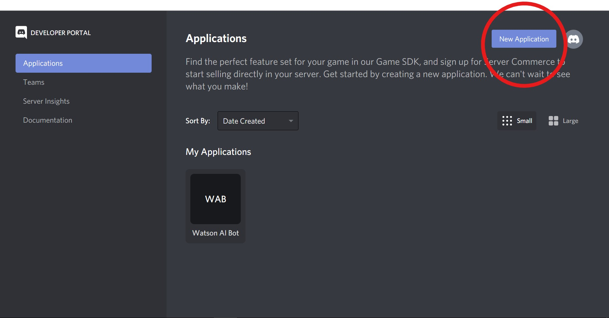</img>
</p>

Dale el nombre que quieras y haz clic en "Create".

<p align="center">
  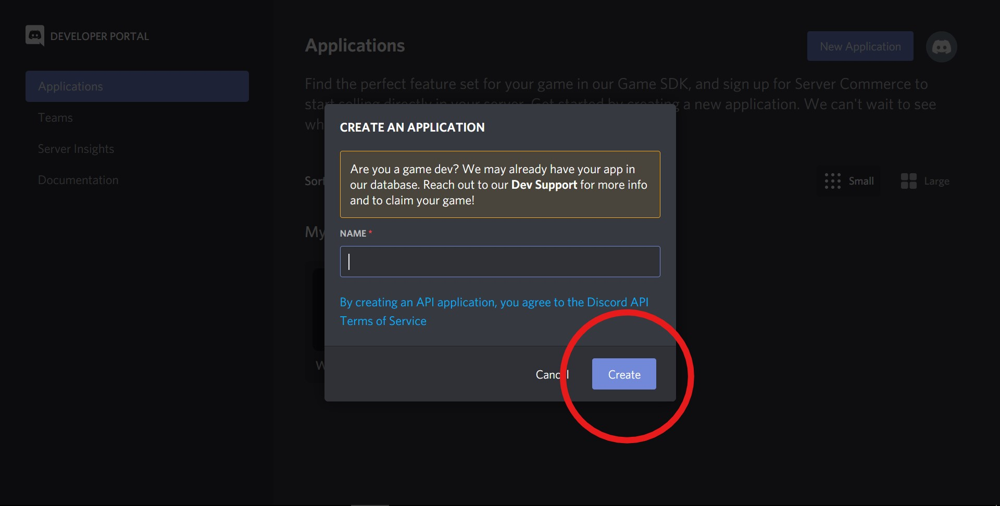</img>
</p>

Ahora deberías estar dentro de los settings de tu aplicación, en nuestro caso, el uso de esta aplicación será el "capullo" de nuestro bot, por lo tanto, podemos dar una descripción de lo que hará nuestro bot dentro de la descripción de la aplicación, luego para continuar, haz clic dentro de la opción "Bot".

<p align="center">
  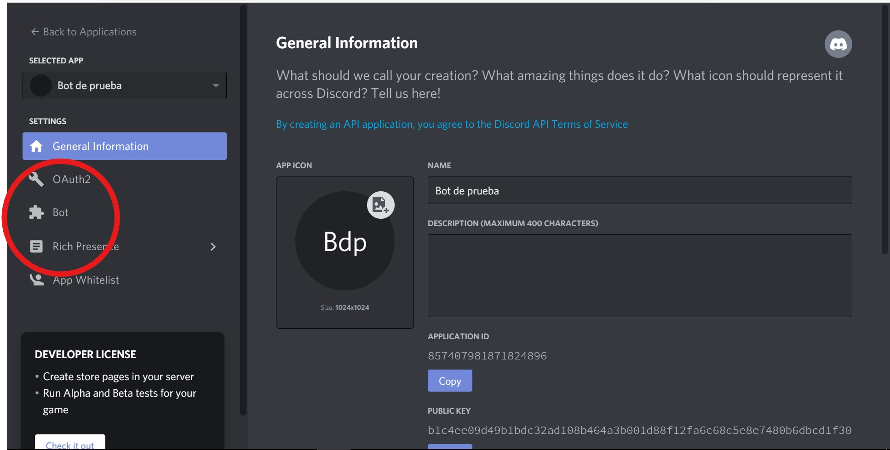</img>
</p>

Haz click en "Add Bot".

<p align="center">
  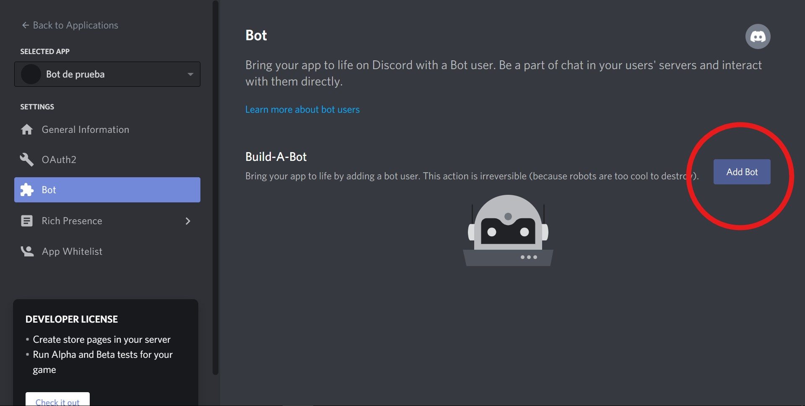</img>
</p>

Ahora ya cuentas con un bot registrado, dale el nombre que quieras (puede ser el mismo nombre que el de la aplicación, la verdad no hay mucha diferencia), coloca el icono que quieras y guarda los cambios. Para pasos posteriores, es **importante que guardes tu token personal del bot**, este token es el que va a permitir controlar y manejar tu bot, es confidencial solo para ti.

<p align="center">
  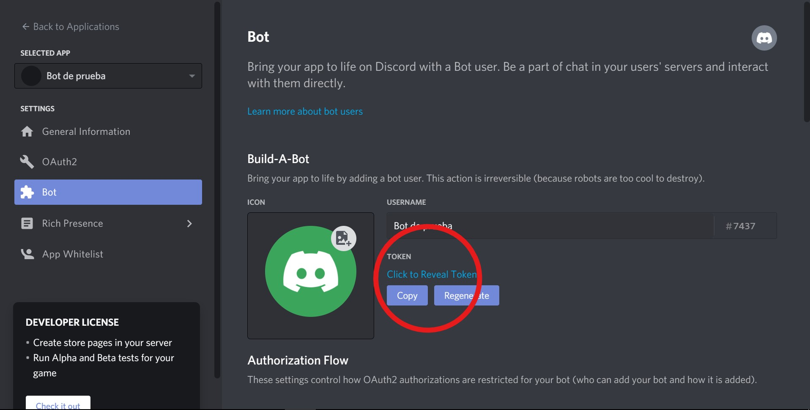</img>
</p>

------------------------------------------------------------------------------------------------------------

### 2. Añade el Bot a un servidor.

Aún nuestro bot no hace nada, pero pronto lo hará, por ahora ya que tenemos registrado el bot podemos añadirlo a un servidor para comenzar a darle características, puedes agregarlo al servidor que tú quieras, pero recomiendo que al inicio lo agregues a un servidor de pruebas para que puedas ir probando sus comandos de forma más cómoda, para esto, debemos hacer lo siguiente:

Visita la [Calculadora de Permisos de Discord](https://discordapi.com/permissions.html), dentro de ellas seleccionaremos todos los permisos, no te preocupes por temas de seguridad y privacidad, nuestro bot solo realizará respuestas a consultas, no tendrá facultades para realizar más acciones que solo responder a textos (aunque él lo quiera).

<p align="center">
  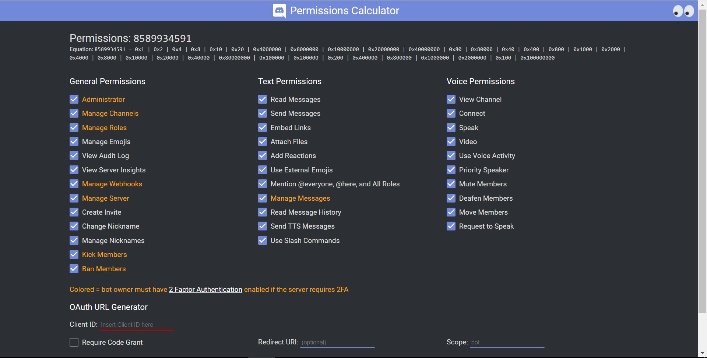</img>
</p>

Luego, vuelve al sitio de los settings de tu aplicación en el Discord Developer Portal, dirígete a "General Information" y copia tu "APPLICATION ID"

<p align="center">
  </img>
</p>

Ahora pega este ID dentro de la Calculadora de Permisos de Discord.

<p align="center">
  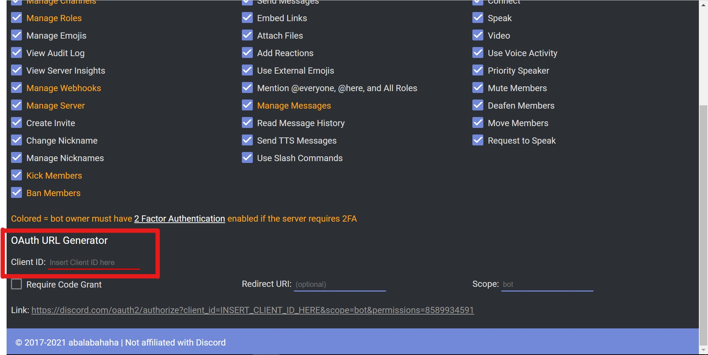</img>
</p>

Hecho esto, ya tienes listo tu enlace propio (y enlace para compartir) para permitir que tu bot entre a tu servidor y al que tú quieras, ingresa al enlace, selecciona el servidor que quieras, y dale a "Continuar"

<p align="center">
  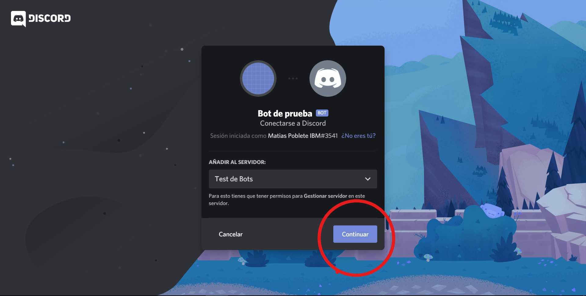</img>
</p>

A continuación, acepta los permisos otorgados al bot haciendo clic en "Autorizar" (Recuerda que el bot solo puede responder comandos que ya están programados, y esto solo contempla llamadas a APIs, por lo tanto, no puede comprometer la privacidad ni seguridad de ningún servidor)

<p align="center">
  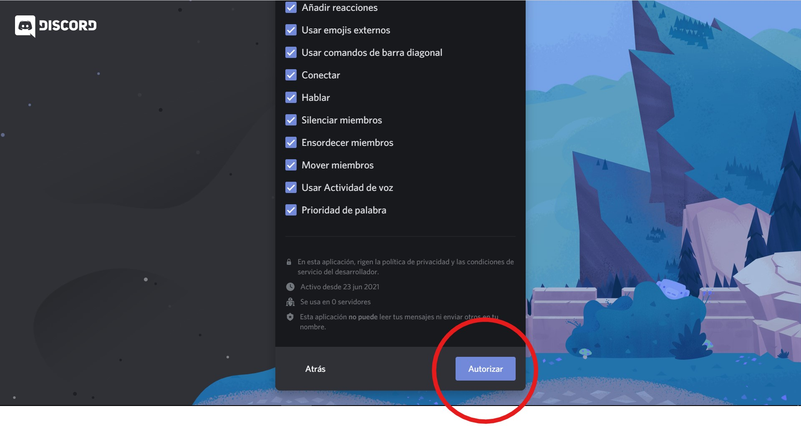</img>
</p>

Si hiciste todo lo anterior, felicidades, ¡ya tienes tu bot (vacío aún) dentro de tu servidor!

<p align="center">
  </img>
</p>

Puedes revisar este video en inglés que recopila todo este proceso: [Code Your Own Discord Bot](https://www.youtube.com/watch?v=j_sD9udZnCk) créditos al canal de Codelyon en Youtube.

------------------------------------------------------------------------------------------------------------

### 3. Démosle vida al bot con Node.js

Finalmente, vamos a construir nuestro bot para que funcione como un chatbot inteligente, para esto debes hacer lo siguiente:

Clona este repositorio en una consola de comandos o bash:

```
git clone https://github.com/matpg/Discord-Watson-AI-Bot.git
```
Entra en la carpeta del proyecto:

```
cd Discord-Watson-AI-Bot 
```
Ya dentro de esta carpeta encontramos todo lo necesario para dar vida al bot, tenemos el archivo "main.js" desde el cual se orquesta las funciones del bot, todo escrito en Node.js, tenemos también la carpeta "commands" en los cuales encontramos los comandos base e iniciales como "ping.js" y los de Watson como "lang_translator.js", "nlu_analyzer_cat.js", "nlu_analyzer_con.js" y "tone_analyzer.js" además de contar con el archivo Dockerfile que permitirá construir una imagen con todo lo necesario para correr nuestro bot, ¡Sin tener que programar nada!

Las funciones inteligentes ya se encuentran programadas, solo debes darle acceso a ellas a través de los servicios que ya tienes creados como se detallan en los **Prerequisitos** de este code pattern, para conectar estos accesos, abre y modifica el archivo ".env_sample" el cual es un template de todos los accesos que necesita el bot, copia todas las API Keys y Service Url de tus recursos de Watson y pegalos, además de copiar y pegar el token de tu bot que se muestra en el paso **1. Registra un nuevo Bot en Discord Developers**, si te queda alguna duda de cómo conseguir estos accesos, ingresa a la documentación en **Tecnologías**.

<p align="center">
  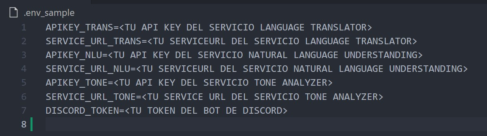</img>
</p>

A continuación, renombra el archivo anterior a solo ".env".

Teniendo todo lo anterior listo, podemos proceder a construir la imagen completa de los recursos de nuestro bot con Docker, como ves, no hay nada de programación hasta ahora, y tampoco habrá, ya que los comandos ya están programados anteriormente, de los cuales te contaré más después de ejecutar el bot.

Para construir la imagen del bot, en la raíz del proyecto clonado corremos lo siguiente:

```
docker build -t <NOMBRE QUE ELIJAS PARA EL BOT> .
```

Esperamos su construcción, luego corremos lo siguiente:

```
docker run <NOMBRE QUE ELIJAS PARA EL BOT>
```
Si todo salió bien, deberías ver que tu bot se encuentra en línea, viendo esto en tu consola o bash:

```
Watson AI Bot is online!
```

Si ves algo distinto a esto, procura revisar si los accesos copiados al archivo ".env" son los correctos para tus servicios de Watson.

Ahora, con nuestro bot en línea, deberíamos ver al bot en estado de conectado en el servidor de Discord, como se ve en esta imagen.

<p align="center">
  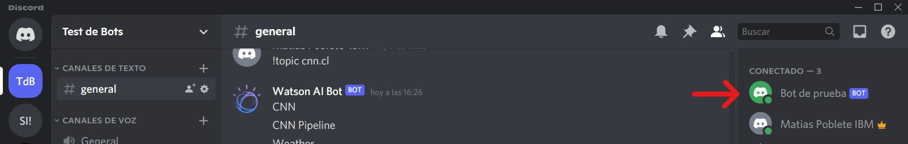</img>
</p>

Llegando a esta parte, el bot se encuentra completamente listo para ser usado, prueba escribiéndole el comando "!help" comenzado con el prejifo "!".

<p align="center">
  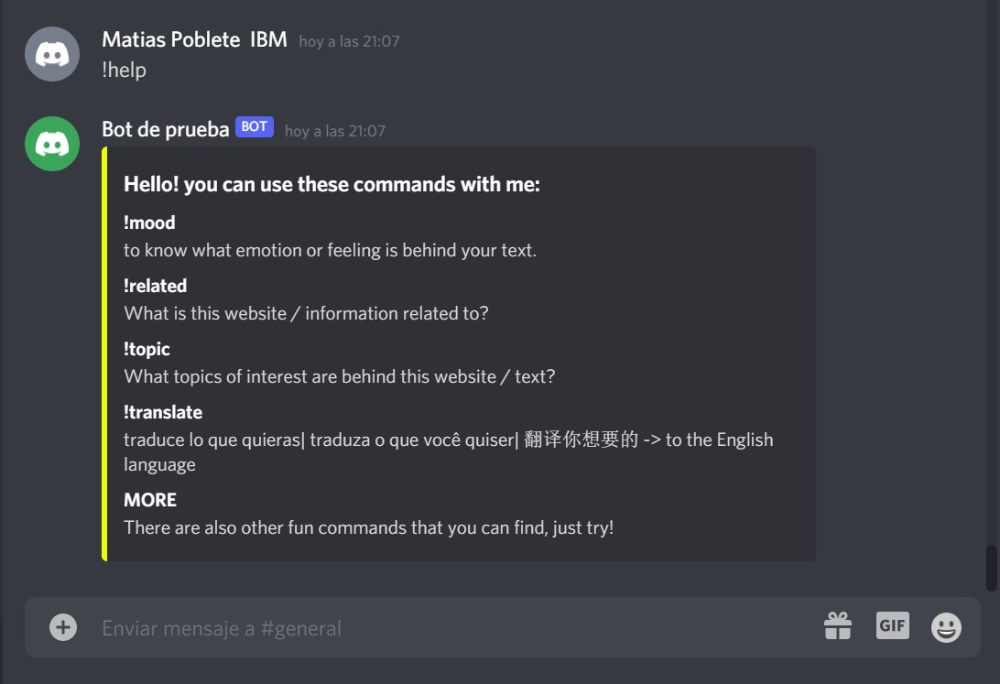</img>
</p>

¡Prueba a utilizar alguno de esos comandos! Puedo explicarte que el comando **!mood** permite conocer alguna emoción o sentimiento encontrado en una oración o párrafo, el comando **!related** te dará una buena idea sobre de que trata un texto de información o sitio web, sin tener que leerlo por completo, y además el comando **!translate** permitirá traducir tu español, portugués o chino al inglés para así no toparse con la barrera del idioma, existen otros comandos divertidos a probar, prueba con revisar la carpeta de "commands" del proyecto y en el programa "main.js" para encontrar los otros comandos... (pista: prueba con "gato" en inglés), en la carpeta "images" encontrarás el logo de Watson si es lo que deseas poner en tu bot.

Estas son algunas imagenes capturadas desde Discord, ¡Disfruta tu bot!

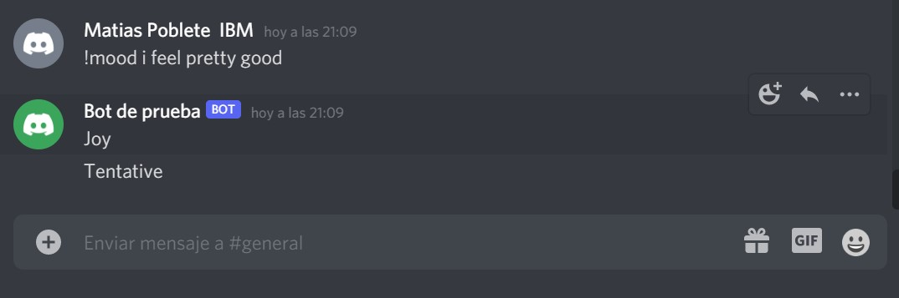</img>
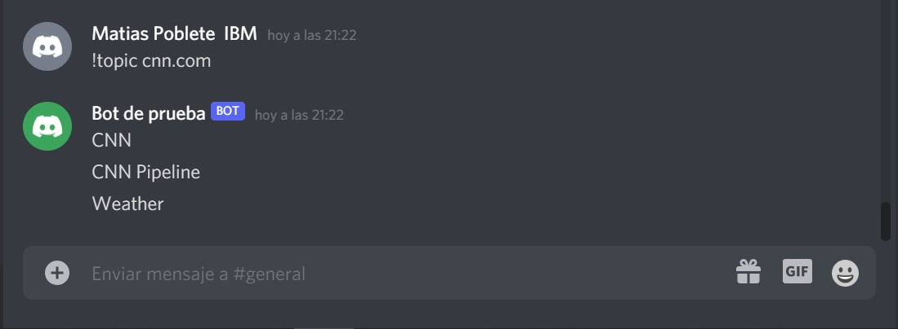</img>
<p align="center"> 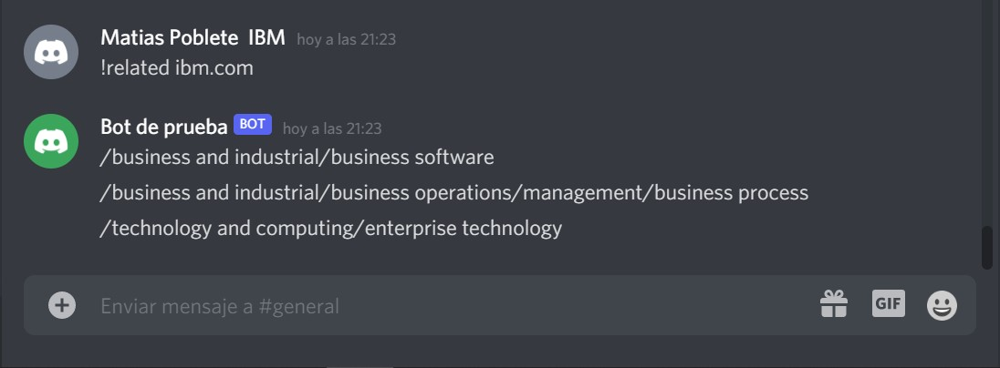</img> </p>

Puedes desplegar este proyecto en Code Engine debido a que cuentas con el código fuente y el Dockerfile, actualmente se encuentra desplegado el bot original en la plataforma debido a lo sencillo y rápido que es para estos propósitos, si quieres conocer cómo desplegarlo te invito a ingresar a [Code Engine: cómo desplegar aplicaciones en 2 simples pasos](https://developer.ibm.com/es/tutorials/code-engine-como-desplegar-aplicaciones-en-2-simples-pasos/) y también conocer más en la sección **Contenido Relacionado**.

## Conclusiones

Mediante este proyecto pudiste conocer tecnologías que ofrece Discord para los desarrolladores, Node.js para el back-end de una aplicación, un pequeño puñado de las capacidades inteligentes que se ofrecen en IBM Cloud/Watson y lo sencillo de construir una imagen de una aplicación a través de Docker, todo esto registrando, integrando y desplegando un bot en la plataforma de Discord, el cual, puedes personalizarlo y mejorarlo para mostrar a clientes y colaboradores.

------------------------------------------------------------------------------------------------------------

## Contenido Relacionado

- [Natural Language Understanding](https://cloud.ibm.com/docs/natural-language-understanding) y [API](https://cloud.ibm.com/apidocs/natural-language-understanding)
- [Language Translator](https://cloud.ibm.com/docs/language-translator) y [API](https://cloud.ibm.com/apidocs/language-translator)
- [Tone Analyzer](https://cloud.ibm.com/docs/tone-analyzer) y [API](https://cloud.ibm.com/apidocs/tone-analyzer)
- [Documentación de Desarrolladores de Discord](https://discord.com/developers/docs/intro)
- [Como usar una REST API](https://discordjs.guide/additional-info/rest-api.html#making-http-requests-with-node)
- [Code Engine: cómo desplegar aplicaciones en 2 simples pasos](https://developer.ibm.com/es/tutorials/code-engine-como-desplegar-aplicaciones-en-2-simples-pasos/)
- [Desplegar una app en Code Engine](https://developer.ibm.com/patterns/deploy-a-microservices-app-to-ibm-cloud-code-engine/)
- [Docs de APIs de servicios de Watson](https://cloud.ibm.com/docs?tab=api-docs)
- [Proyecto en inglés: Chatbot para WhatsApp](https://developer.ibm.com/events/update-your-chatbot-on-whatsapp-with-ibm-watson-assistant/)
- [Servicio de Watson Assistant](https://developer.ibm.com/learningpaths/get-started-watson-assistant/)

## Licencia

Este Code Pattern se encuentra licenciado bajo Apache License, Version 2. Objetos de código de terceros invocados en dentro de este Code Pattern se encuentran licenciados bajo sus respectivos proveedores en conformidad con los términos de sus correspondientes licencias. Todas las contribuciones se encuentran sujetas al [Developer Certificate of Origin, Version 1.1](https://developercertificate.org/) y la [Apache License, Version 2](https://www.apache.org/licenses/LICENSE-2.0.txt).

[Preguntas frecuentes sobre Apache License](https://www.apache.org/foundation/license-faq.html#WhatDoesItMEAN)
