# Despliega tu primer modelo de reconocimiento de imágenes en la nube

## ¿Qué se realizará en este code pattern?

Se entrenará un modelo de clasificación de imágenes utilizando el reconocido dataset llamado Fashion MNIST para clasificar imágenes de diferentes prendas de ropa. También, este se desplegará en Watson Machine Learning para posibilitar la utilización de este modelo para clasificar imágenes mediante una Api.

## Índice
1. [Contexto - Breve historia de cómo surge la clasificación de imágenes y las redes neuronales](#Contexto)
2. [Redes Neuronales Convolucionales - ¿Cuáles son los componentes internos de nuestro clasificador?](#Redes-Neuronales-Convolucionales)
3. [Pasos para crear un modelo de clasificación de imágenes personalizado](#Pasos-requeridos-para-crear-modelos-personalizados-de-clasificación-de-imágenes)
4. [Creación de entorno - Se crearán las instancias de los servicios necesarios para la creación y despliegue del modelo](#Creación-del-entorno)
5. [Correr el código y desplegar el modelo](#Correr-el-código)
## Contexto
Desde los años 70, Gordon Moore observó que el número de transistores en los microprocesadores se duplica cada 2 años. Este fenómeno, llamado Ley de Moore, es una de las razones por la cual el poder computacional ha crecido exponencialmente en los últimos 50 años. Debido a esto, podemos realizar tareas cada vez más complejas con computadoras.

La rama de la computación llamada Computer Vision (visión computacional) se ha beneficiado enormemente gracias a la inmensa capacidad de procesamiento de la actualidad. Dicha rama se dedica a procesar, analizar y comprender imágenes del mundo en el que vivimos, con el fin de actuar según sea requerido en una situación determinada. En este code pattern, la subrama dentro de Computer Vision en la que nos centraremos es en la de Clasificación de imágenes.

### Clasificación de imágenes 
Previo a los avances tecnológicos de los últimos años, una enorme cantidad de imágenes eran clasificadas manualmente cada día por personas que se dedicaban únicamente a ese fin. Desde doctores observando imágenes de laboratorio para detectar tumores u otros cuerpos extraños en tomografías, hasta catalogación de documentos en empresas de seguros, la clasificación de imágenes suponía una tarea manual extremadamente tediosa. En los próximos años, se prevé que una gran parte de estas tareas serán realizadas por algoritmos inteligentes, llamados modelos de clasificación de imágenes. 

Dichas tareas requieren que un sistema o modelo aprenda patrones a partir de datos y no a partir de reglas definidas por humanos. Claramente, el concepto más relacionado con este es el Machine Learning, la rama de la inteligencia artificial destinada a construir aplicaciones que aprenden de datos y mejoran la certeza de sus predicciones con el tiempo, sin ser programadas para hacerlo.

### Redes neuronales
En el año 1943 Warren McCulloch y Walter Pitts propusieron la neurona artificial, el primer modelo computacional cuyo propósito era emular los eventos y relaciones entre las neuronas de un cerebro humano a partir de lógica proposicional. Dicho tipo de modelo computacional adquirió el nombre de red neuronal, y este subcampo del Machine Learning fue nombrado Deep Learning.

En las últimas décadas, el rendimiento en cuanto a clasificación de imágenes de las redes neuronales ha superado al rendimiento de otros algoritmos de Machine Learning. En particular, las redes neuronales convolucionales (y sus variantes) han demostrado ser la mejor arquitectura de red neuronal para tareas relacionadas con Computer Vision.

## Redes Neuronales Convolucionales
Las redes neuronales convolucionales se distinguen de otras redes por su rendimiento superior cuando se trabaja con imágenes y audio. Estas redes tienen 3 tipos de capas principales:

•	Capa convolucional (convolutional layer)

•	Capa de agrupamiento (pooling layer)

•	Capa completamente conectada (Fully connected layer)

Por lo general, estas redes se construyen colocando una o varias capas convolucionales seguidas por una capa de agrupamiento. Esto se repite varias veces y luego, al final de estas, se colocan un par de capas completamente conectadas.

  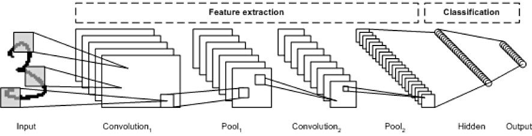

### Explicación simplificada de convolución 
Las capas de convolución aplican filtros a la imagen original, y también a los mapas de características (feature maps) para extraer patrones (contornos, colores) que sirvan para entender y luego clasificar una imagen. Los mapas de características son las transformaciones de la imagen inicial que se encuentran en las capas intermedias de nuestra red neuronal.

  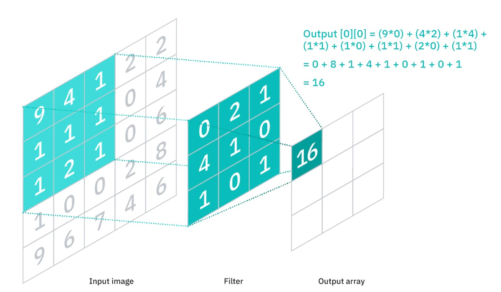

Las capas de agrupamiento tienen el propósito de reducir las dimensiones de estos mapas de características, buscando promedios o máximos en un conjunto de pixeles.  Cuando avanzamos a la siguiente capa, este conjunto de pixeles será representado como un único píxel que contiene el promedio de los valores de los pixeles antes mencionados (average pooling).

La idea detrás de esto es que, por ejemplo, en una imagen de un vehículo rojo, si nosotros estamos parados sobre un pixel rojo, lo más probable es que los pixeles cercanos también sean rojos. Al reducir las dimensiones, nos libramos de datos redundantes que incrementan los tiempos de entrenamiento considerablemente.
 
 En la imagen a continuación se puede visualizar la transformación que haría una capa de max pooling de 2x2. Esta reduce las dimensiones de la imagen a la mitad, tomando los valores máximos de cada sección de la misma. Para el agrupamiento utilizado, la imagen se dividirá en 4 secciones, siendo la primera la que contiene a los pixeles con valores 17, 9, 6 y 20.

  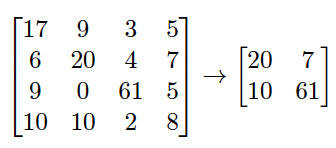

Al final de la red, se ubican un par de capas completamente conectadas, las cuales contienen neuronas interconectadas que se encargarán de la clasificación, produciendo probabilidades de 0 a 1 para cada imagen que queramos clasificar. La última capa completamente conectada es la responsable de mapear las probabilidades de la capa anterior para decidir si ese conjunto de probabilidades indica que el tipo de objeto que quiero clasificar se encuentra en la imagen.

  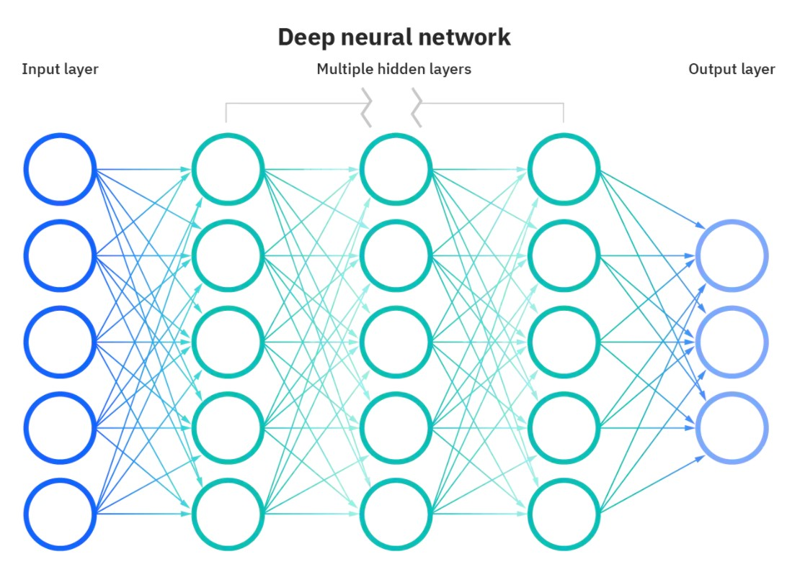

Para una explicación más detallada sobre el funcionamiento interno de las redes neuronales convolucionales, visitar el siguiente [link.](https://www.ibm.com/cloud/learn/convolutional-neural-networks)

## Pasos requeridos para crear modelos personalizados de clasificación de imágenes
En la creación de un modelo personalizado de clasificación de imágenes, recomiendo que el lector siga una serie de pasos definidos.

#### 1)	Carga de datos
En el paso de la carga de datos, nos enfrentamos a una serie de problemas. El primero es conseguir un dataset de imágenes. En este code pattern utilizaremos el dataset de Fashion MNIST que contiene 60000 imágenes de entrenamiento y 10000 imágenes para testeo. Para casos en donde se desea utilizar un dataset propio, el lector deberá encargarse de elegir imágenes representativas, definir las clases que querrá reconocer y separar las imágenes en un set de entrenamiento y uno de testeo.

#### 2)	Preprocesamiento de imágenes

Para el preprocesamiento, primero es necesario conocer las imágenes con las que trabajaremos. En el caso de Fashion MNIST, su representación digital será una matriz de L x A (largo por ancho en pixeles) y los valores estarán comprendidos entre 0 y 255 representando la luminosidad del pixel. En el caso de imágenes a color, se agrega una dimensión extra, y la representación de la imagen pasa a ser un Tensor tridimensional de L x A x C, donde C = 3 si estamos utilizando RGB para representar los colores. 

Por lo tanto, para el normalizado de las imágenes en blanco y negro de nuestro dataset, debemos centrar los valores en 0 y acotarlos a un rango [-1;1]. Este normalizado mejorará el rendimiento de nuestro modelo.

#### 3)	Creación de la red neuronal y elección de su arquitectura 
Dado que este es un code pattern introductorio, la arquitectura de la red será relativamente simple.  Dicha red neuronal será entrenada desde 0 y contendrá las siguientes capas. Convolucional -> Agrupamiento máximo ->  Convolucional ->  Agrupamiento máximo ->  Convolucional ->  Agrupamiento máximo ->  Completamente conectada ->   Completamente conectada -> Salida.

  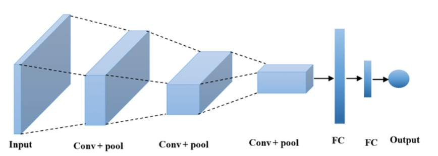

#### 4)	Despliegue del modelo obtenido
Cuando el modelo alcanza resultados satisfactorios, la siguiente pregunta será ¿Cómo podemos hacer para incorporar este modelo en una solución que posee la necesidad de clasificar imágenes? 
Una respuesta posible, y la opción que tomaremos en este code pattern será desplegar nuestro modelo en Watson Machine Learning, que nos provee una forma simple de utilizar nuestro modelo personalizado para clasificar imágenes mediante una Api.

# Creación del entorno

El lector deberá crear una instancia de Cloud object storage y una instancia de Watson Studio. Luego de iniciar Watson Studio, se debe crear un proyecto y agregar un notebook al proyecto. Recomiendo que escojan el entorno de Python 3.7 con mayor potencia de procesamiento, ya que el entrenamiento de la red neuronal es costoso. Si se tiene un plan pago (no es necesario para este caso), se pueden escoger entornos de desarrollo con GPUs, que disminuyen drásticamente los tiempos de entrenamiento.

A continuación, se explicará cómo crear cada componente necesario para el correcto funcionamiento de la solución.

1. [Creación de cuenta IBM Cloud.](#Crear-una-cuenta-de-IBM-Cloud)
2. [Creación de instancia del servicio Object Storage.](#Crear-una-instancia-del-servicio-Cloud-Object-Storage)
3. [Creación de instancia del servicio Watson Studio.](#Crear-una-instancia-del-servicio-Watson-Studio)
4. [Creación del proyecto de Watson Studio.](#Crear-proyecto-de-Watson-Studio)
5. [Creación del entorno de desarrollo con Notebooks.](#Crear-Watson-Studio-Notebook)
6. [Creación de la instancia del servicio Watson Machine Learning.](#Crear-instancia-de-Watson-machine-Learning)

### Crear una cuenta de IBM Cloud
Lo primero que el lector debe hacer es crearse una cuenta en IBM Cloud. Se puede crear una cuenta totalmente gratuita y no es necesario ingresar una tarjeta de crédito para crearla. Para ello, visitar [IBM Cloud](cloud.ibm.com) y seguir los pasos para la creación de cuenta. Si usted ya posee una cuenta, se puede saltear este paso.

### Crear una instancia del servicio Cloud Object Storage

Para esto, navegar hacia la página de inicio de [IBM Cloud](cloud.ibm.com).  A continuación, se verá la siguiente pantalla.

  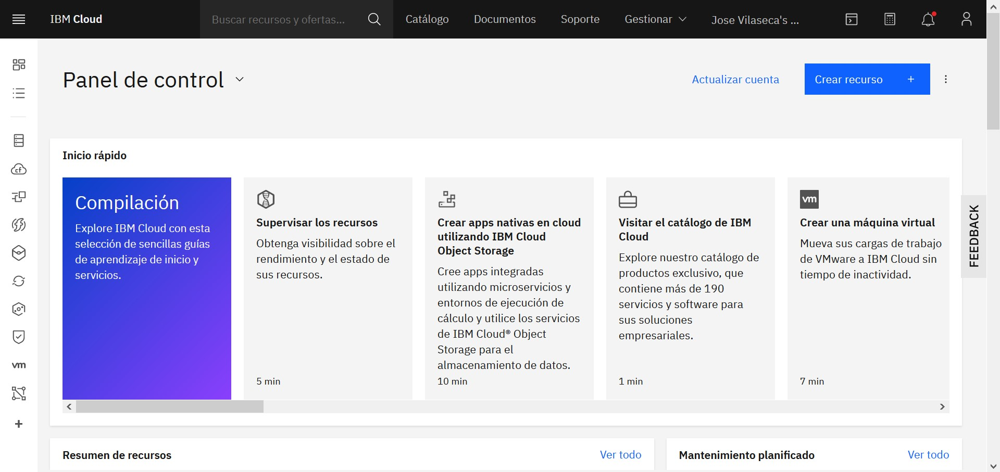

En esta pantalla, se debe clickear en “Catálogo” en la barra de navegación de la parte superior de la página.

  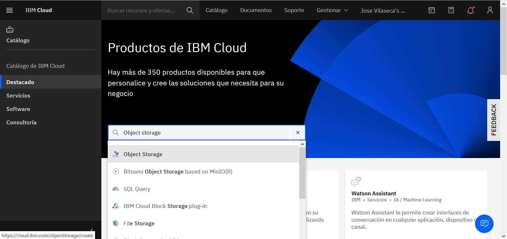

Después de presionar en catálogo, buscar Object Storage en el buscador y seleccionar la opción con dicho nombre. Se podrá ver la siguiente página.

  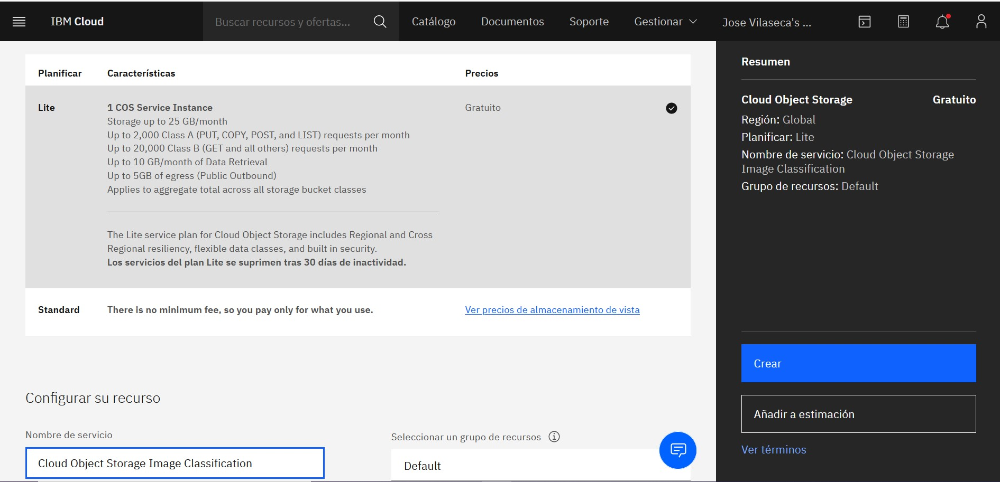

Aquí, debemos seleccionar el plan Lite (plan gratuito) y debemos elegir un nombre para nuestra instancia del servicio. Cuando se haya escogido un nombre, clickear en crear para crear la instancia.

  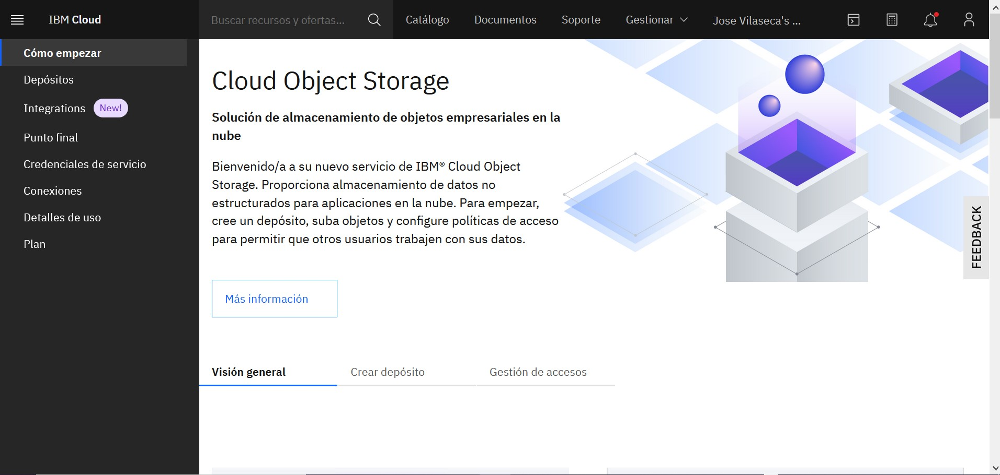

Con nuestra instancia ya creada, seleccionemos IBM Cloud en la parte superior izquierda de la pantalla para volver a la página principal de IBM Cloud.

## Crear una instancia del servicio Watson Studio

Para la creación de una instancia de Watson Studio, se deberá hacer un proceso similar Por esto cliquearemos en Catálogo nuevamente.

Luego de clickear en catálogo, ingresar Watson Studio en el buscador y seleccionar la primera opción.

  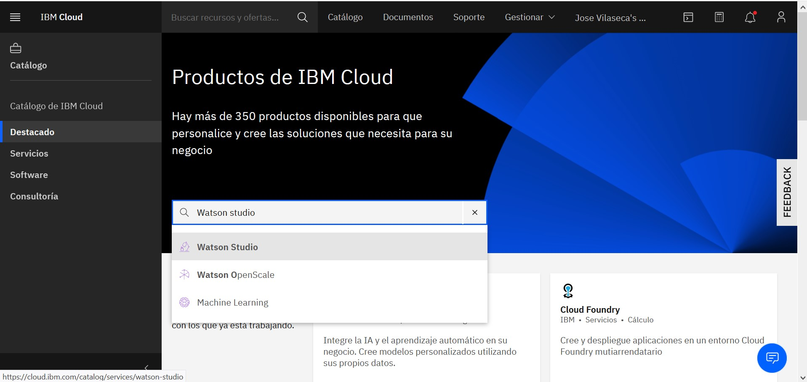

Dejar la ubicación seleccionada por defecto (Dallas (us-south)) y escoger el plan lite.

  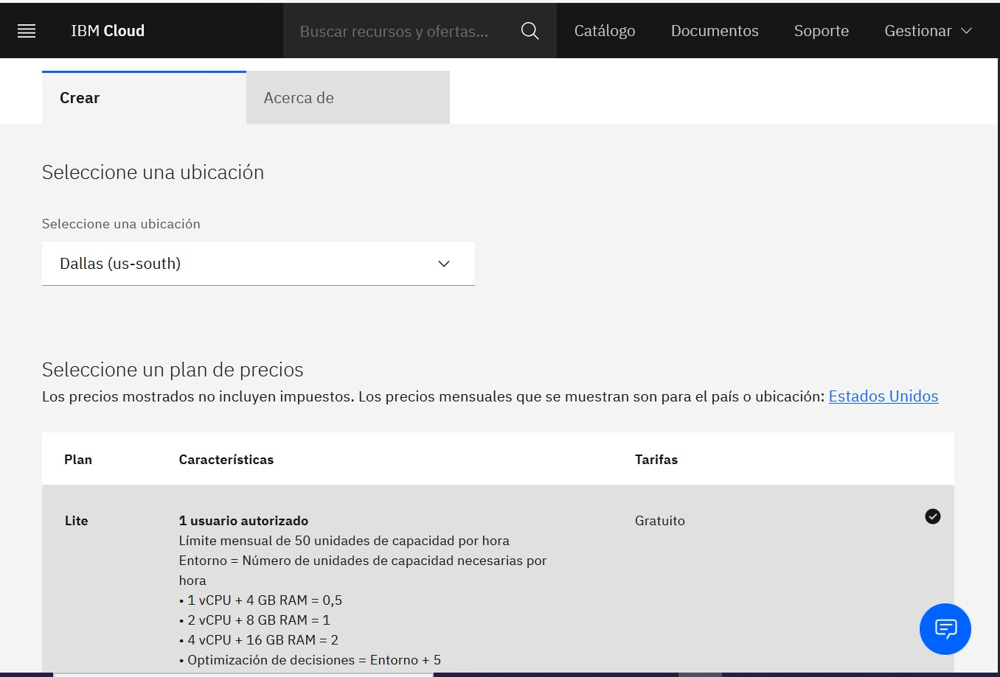

Elegir un nombre para la nueva instancia y clickear en crear.

  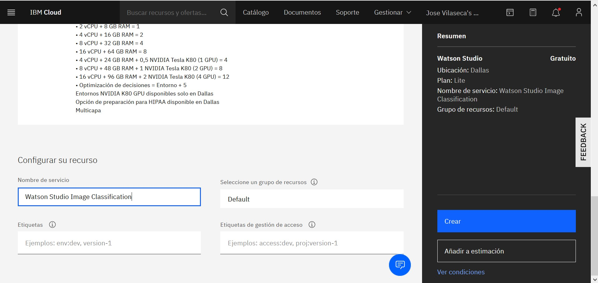

Con las 2 instancias necesarias ya creadas, clickear en Iniciación para iniciar el servicio de Watson Studio. 

  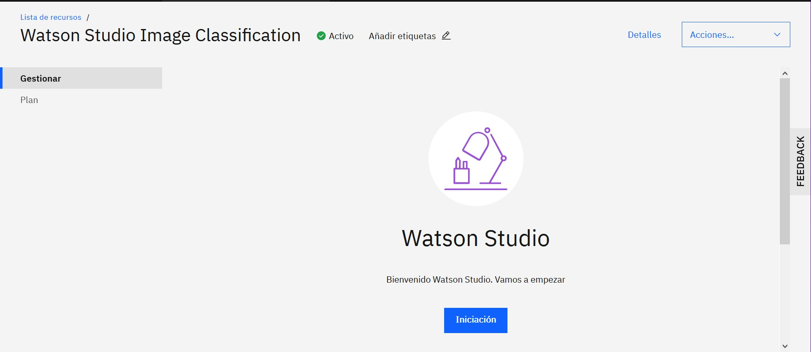

## Crear proyecto de Watson Studio
Lo siguiente que debemos hacer es crear un proyecto, por lo que clickearemos en Crear un proyecto (debajo del subtítulo “Trabajar con datos”).

  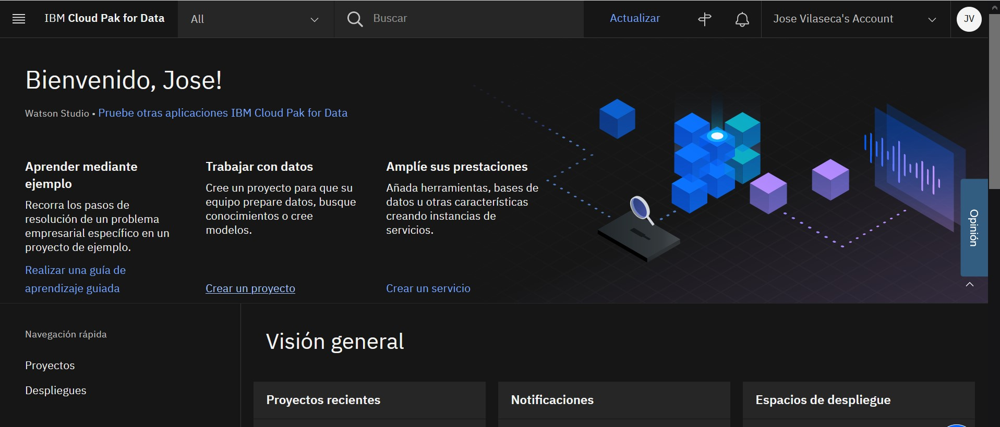

Debemos elegir crear un proyecto vacío.

  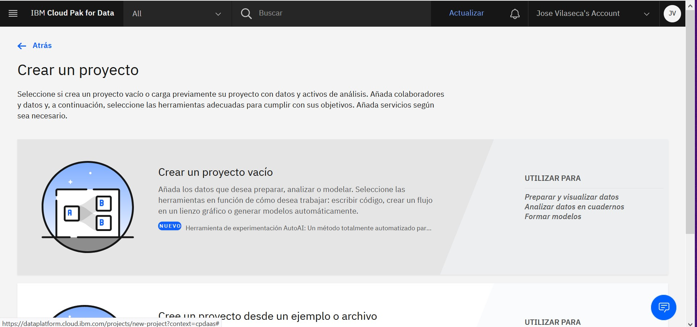

En el paso actual, debemos nombrar al proyecto, además de proveer una descripción de este si se desea. Nótese que bajo almacenamiento aparece la instancia de Cloud Object Storage que creamos anteriormente. Para continuar, hacer click en crear. 

  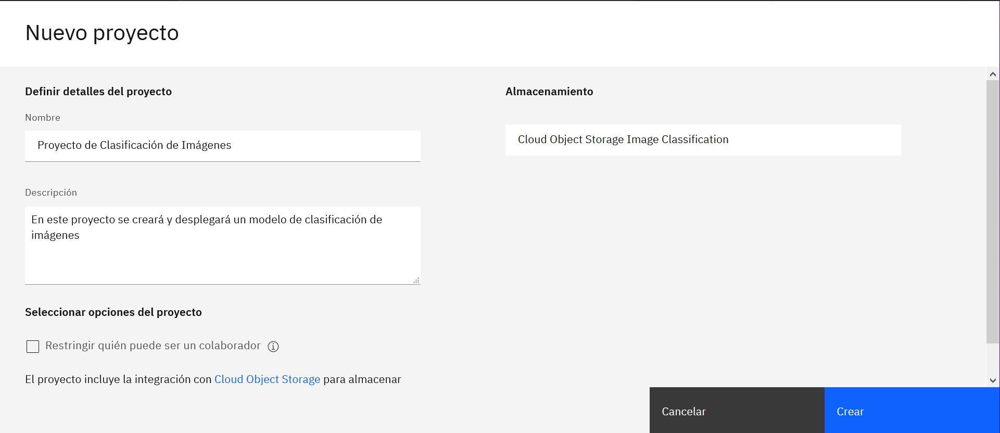

## Crear Watson Studio Notebook

En este momento, estamos en la vista general del proyecto. Lo siguiente que debemos hacer es añadir un Notebook a este, y lo haremos de la siguiente forma. Se debe seleccionar “Añadir al proyecto”.

  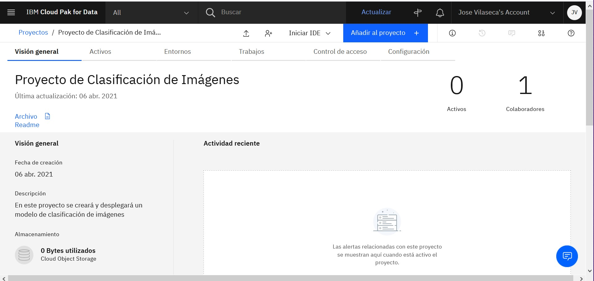

En el modal que contiene los tipos de activo, debemos elegir el que dice Notebook.

  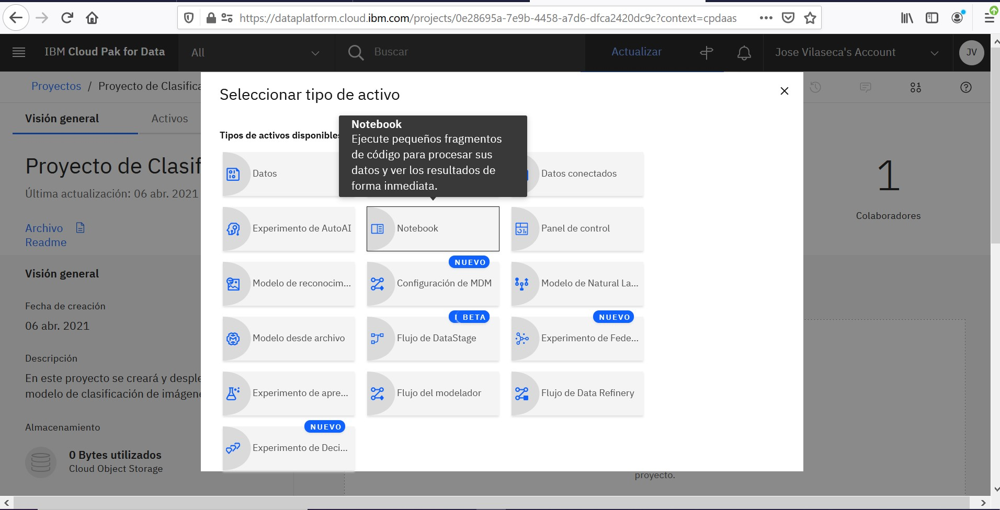

Como nuestra intención es cargar un notebook desde un archivo .ipynb existente, hay que elegir la opción “Desde el archivo”. Luego, nombrar y dar una descripción al notebook. A continuación, seleccionar el entorno de ejecución de Python 3.7 que posee 4 vCPU y 16 GB de ram. Si se tiene un plan pago, se puede escoger un entorno con GPU para que los entrenamientos sean más veloces, pero no es necesario para este code pattern. Por último, arrastrar el archivo .ipynb presente en la carpeta raíz del repositorio github hacia la ventana del navegador.

  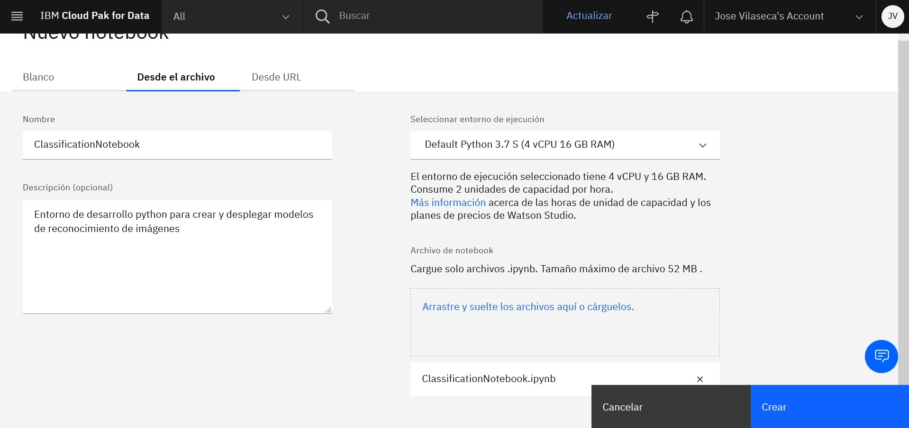

Para poder editar y correr el notebook, se debe presionar en el lápiz que está en la parte superior centro de la pantalla.

  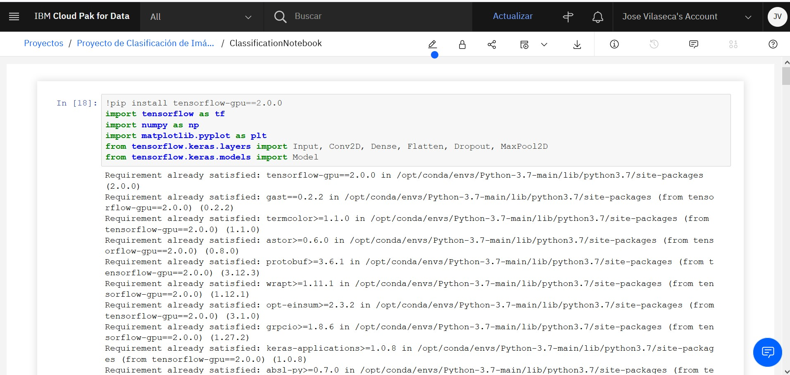

## Crear instancia de Watson machine Learning

Previo a correr el código crearemos nuestro servicio de Watson Machine learning, el cual nos posibilitará desplegar el modelo que crearemos en el notebook.
Por esta razón , en un nueva pestaña, ir al catálogo de IBM Cloud y buscar Machine Learning.

  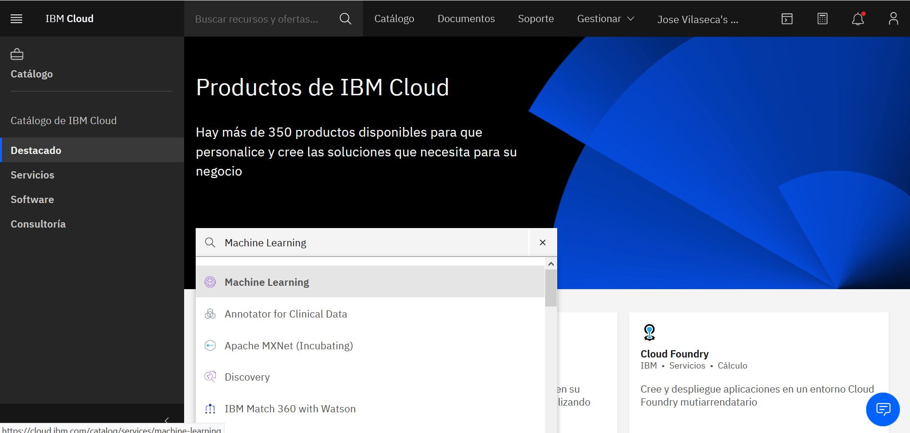

Seleccionar la ubicación Dallas y el plan Lite

  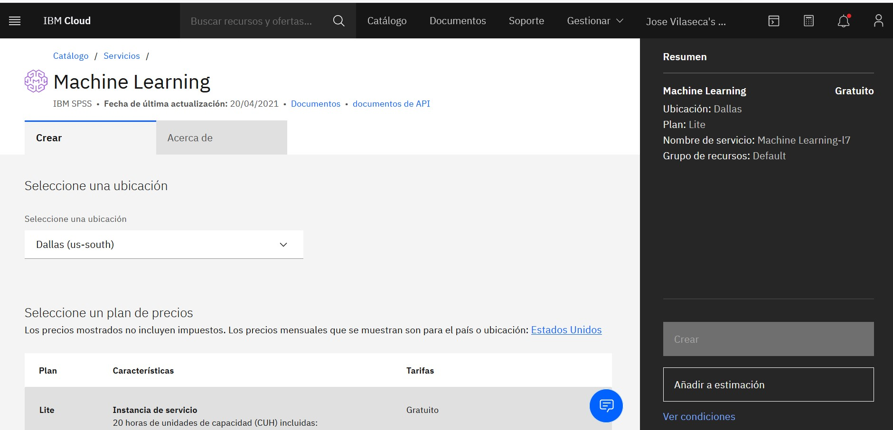

Elegir un nombre y hacer click en crear

  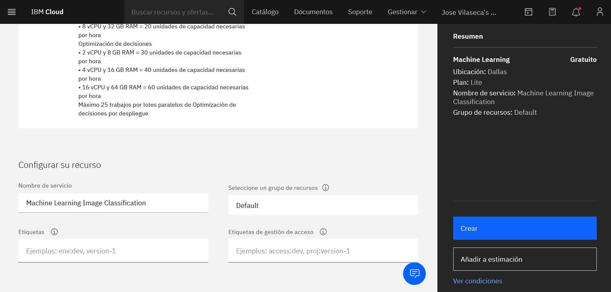

Lo siguiente que debemos hacer es crear un espacio de despliegue. Para ello regresamos a la [página principal de IBM Cloud Pak for Data](https://dataplatform.cloud.ibm.com/home2?context=cpdaas) y vamos a la sección de **Despliegues** en la parte inferior izquierda de la imagen.

  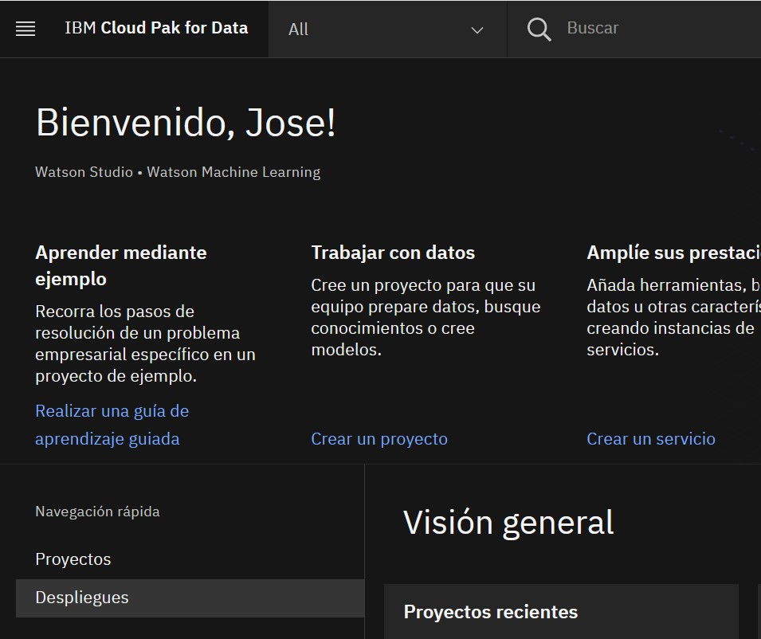

En esta página haremos click sobre el botón de Crear nuevo espacio de despliegue

  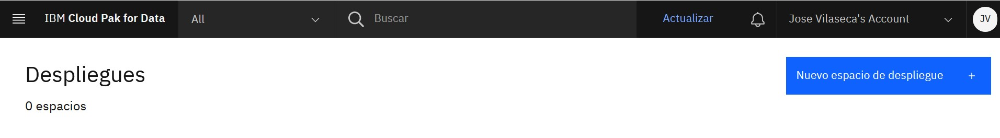

Aquí configuraremos los datos de nuestro espacio, en este caso solo basta con cambiar el nombre y seleccionar el servicio de Watson Machine Learning que recién creamos. Al tener todo listo hacemos click en Crear.

# Correr el código
Luego de creado nuestro espacio de despliegue, es momento de comenzar a editar el código. Para ello, navegar hacia la sección Activos dentro del proyecto. Para llegar al proyecto, se puede navegar hacia la [página principal de IBM Cloud Pak for Data](https://dataplatform.cloud.ibm.com/home2?context=cpdaas), y luego seleccionar el proyecto creado.

  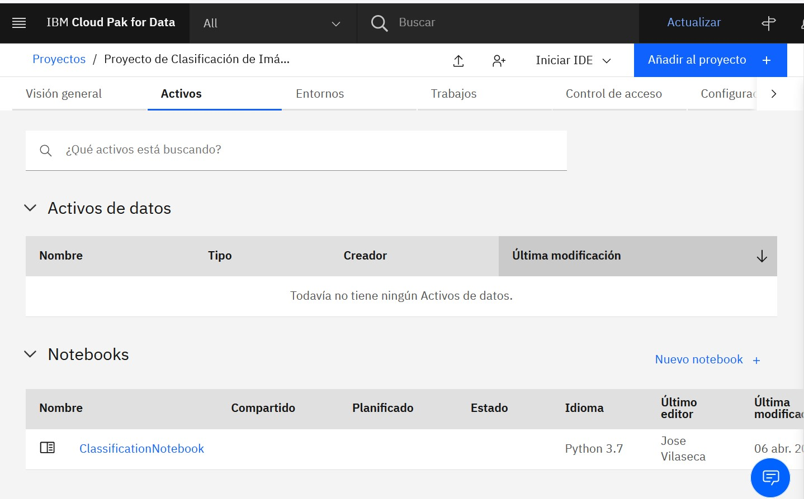

Hacer click sobre el Notebook llamado **ClassificationNotebook**. Para poder editar el Notebook, debemos clickear en el lápiz que se muestra en la siguiente imagen.

  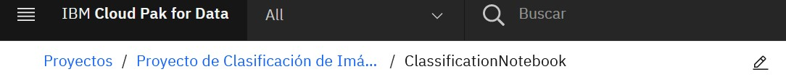

En la primera celda, tendremos que configurar las variables de nuestra instancia de Watson Machine Learning. Aquí necesitaremos una API Key de IBM Cloud y la ubicación de nuestra instancia de Watson Machine Learning

  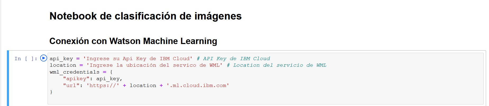

Para crear una API Key de IBM Cloud, debemos navegar hacia la [página principal de IBM Cloud](cloud.ibm.com), clickear en Gestionar y elegir Acceso (IAM)

  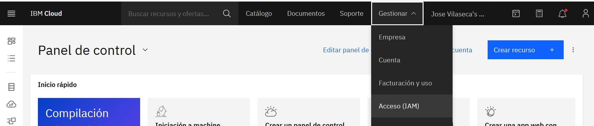

Luego se debe seleccioanr **Claves de Api** en la barra de navegación de la izquierda, donde nos aparecerá la opción de **Crear una clave de API de IBM Cloud**. Elegir dicha opción.

  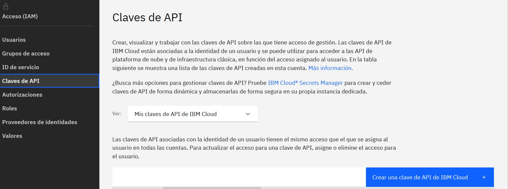

Cuando ya se tenga la clave, igualar la variable api_key al valor de la clave. Para la variable location, ingresar us-south si es que eligieron la región de Dallas para el servicio de Machine learning. Si eligieron otra ubicación, se pueden fijar en la [documentación de Watson Machine Learning](https://cloud.ibm.com/apidocs/machine-learning#endpoint-url) para ver los endpoints de las distintas regiones.

El último paso de configuración que se debe hacer es obtener el id del espacio de despliegue que creamos anteriormente. Para ello, debemos navegar hacia nuestro [espacio de despliegue](https://dataplatform.cloud.ibm.com/ml-runtime/spaces?context=cpdaas) y vamos a la sección Administrar (Manage).

  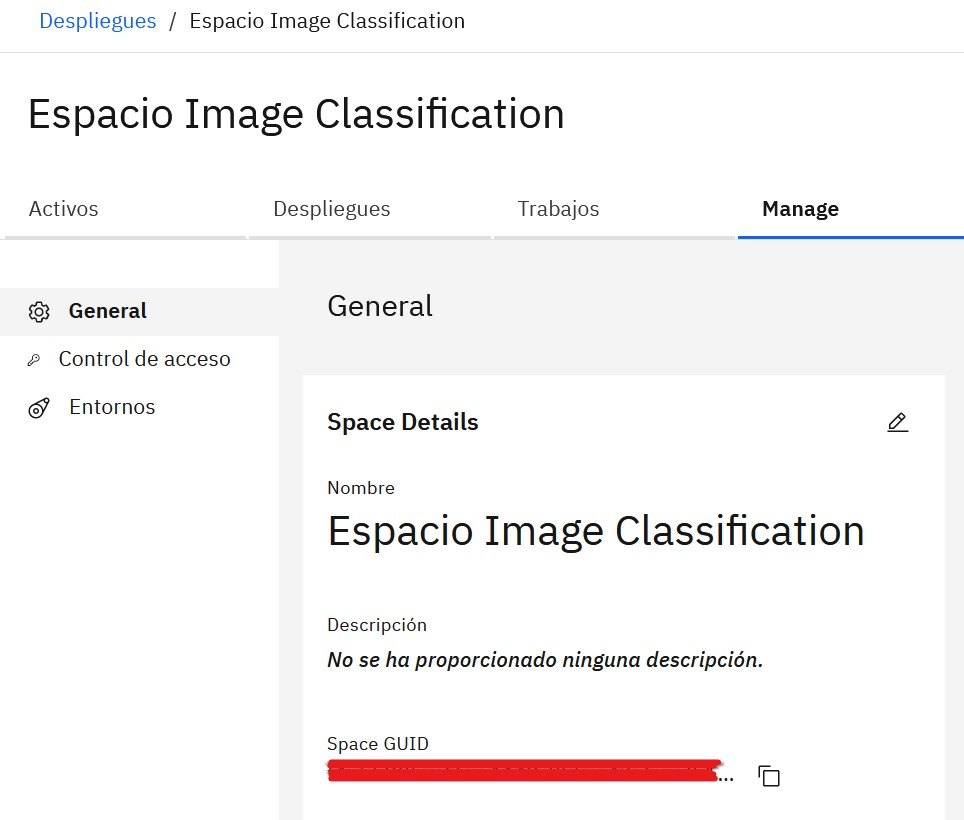

Copiamos el valor bajo Space GUID y lo pegamos en el Notebook en la variable space_id.

### Correr el código
Para correr el código, podemos correr las celdas secuencialmente una a una o podemos decidir correrlas todas, una a continuación de otra. Para la última opción podemos ir a **Cell -> Run All**

  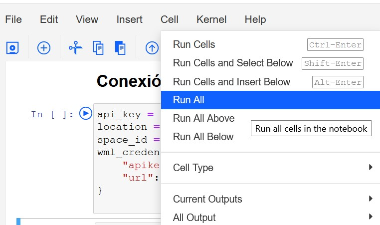

Mientras que van corriendo las celdas, recomiendo al lector que lea los comentarios de las mismas así como las operaciones que se hacen. De este modo, uno se familiarizará con las librerías Keras y Tensorflow que lo ayudarán a crear modelos más complejos en un futuro.

Cuando el código se termina de ejecutar, podemos volver al [espacio de despliegue que creamos](https://dataplatform.cloud.ibm.com/ml-runtime/spaces?context=cpdaas)

  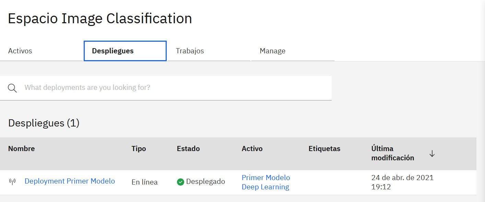

Si entramos al deployment, podremos ver fragmentos de código en distintos lenguajes que muestran cómo invocar a nuestra api.

  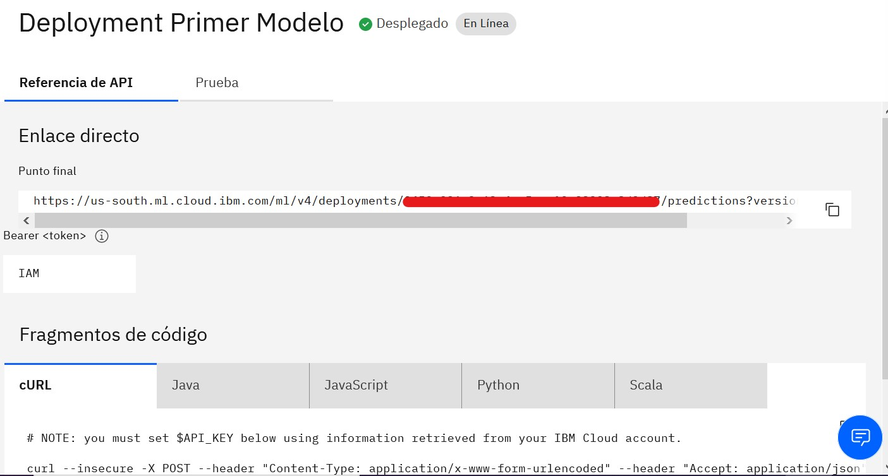

## Resumen
En este code pattern, aprendimos sobre algunos conceptos básicos de redes neuronales para clasificación de imágenes, además de cómo crear un modelo y desplegarlo en la nube. 

## Siguientes pasos
Si este code pattern te pareció interesante y te interesaría seguir aprendiendo sobre redes neuronales para clasificación de imágenes, recomendaría leer sobre Transfer Learning y Data Augmentation como siguientes pasos.

## Links
[Despliega tu modelo de Machine Learning en la nube con Watson](https://github.ibm.com/IBMCode/IBMCodeContent-Spanish/issues/62)

[Convolutional Neural Networks](https://www.ibm.com/cloud/learn/convolutional-neural-networks)

[FashionMnist](https://arxiv.org/abs/1708.07747)

[Arquitectura Red](https://www.researchgate.net/figure/Structure-of-convolutional-neural-network-with-3-convolution-and-pooling-conv-pool_fig8_335107259)
