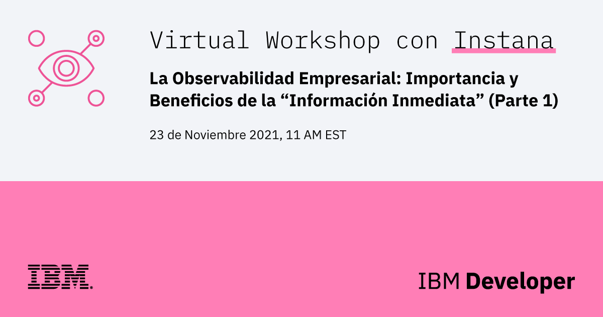

# IBM & Instana - Observabilidad empresarial con Instana (Parte I)

## Descripción

IBM & Instana Presentan: La Observabilidad Empresarial: Importancia y Beneficios de la "Información Inmediata" (Parte 1)

A medida que los sistemas distribuidos crecen, se vuelven más complejos y más difíciles de administrar. La cantidad de datos generados por las aplicaciones basadas en microservicios es más de lo que cualquier humano, o incluso un grupo de humanos, puede procesar por si solos. Debido a esto, AIOps es esencial para la gestión adecuada de todos los datos de Observabilidad. Para evitar la sobrecarga de métricas, debemos analizar los beneficios y la importancia de la Observabilidad.

En este webinar exclusivo, creado por IBM Developer e Instana, discutiremos las diferencias clave entre el monitoreo (simple) y la observabilidad (empresarial) y profundizaremos en las preguntas que deberán ser respondidas por la Observabilidad de nuestra aplicación basada en microservicios. 

Durante esta sesión abordaremos los tres pilares de la observabilidad: 

- Salud / Métricas de Performance
- Trazas (distribuidas)
- Logs
 
También tendremos una sesión práctica para ver como los datos son capturados automáticamente en la plataforma de Instana.

### Objetivos de Aprendizaje

En este webinar los participantes aprenderán sobre:

- Conceptos clave y valor de la Observabilidad (Empresarial)
- Introducción al desarrollo impulsado por la Observabilidad
- Información obtenida de las trazas distribuidos en la plataforma de Instana
- Cómo aplicar la observabilidad en el ciclo de vida de desarrollo

## Speakers

- Julia Leyton - Instana Customer Success Manager
  -  [/julia-leyton-2930732a](https://www.linkedin.com/in/julia-leyton-2930732a/)
- Josefina R. Casanova - IBM Developer Advocate
  -  [/josefinarcasanova](https://www.linkedin.com/in/josefinarcasanova/)
- Gabriela Retamosa - Build Ecosystem & Developer Advocacy 
  -  [@gabyret](https://twitter.com/gabyret)
  -  [/gabriela-retamosa-saint-martin](https://www.linkedin.com/in/gabriela-retamosa-saint-martin/)

## Enlaces de Interés

### Sesión

- [Regístrate en IBM Cloud](https://cloud.ibm.com/registration)
- [Ve el Replay (Próximamente)]()
- [Accede a las slides (Próximamente)]()
- [Free Trial de Instana](https://www.instana.com/trial/)

### ¡Hazlo tú mismo!

- [Code Pattern: Integre Instana con una aplicación de microservicios en OpenShift](https://developer.ibm.com/es/patterns/integrating-instana-with-microservice-app-on-openshift/)
- [Aplicación Bee Travels](https://bee-travels.github.io/)

### Lecturas Recomendadas

- [What Developers need to know about Observability](https://drive.google.com/file/d/1vIKUriKKzsIq25kVKs-b-IhRTdEFDhPR/view)
- [IBM Observability by Instana](https://www.ibm.com/cloud/instana)
- [Instana Docs](https://www.instana.com/docs/)

### ¡Contáctanos!

-  ¿Tienes dudas? ¿Comentarios? ¿Quieres formar parte de una comunidad de desarrolladores de habla hispana? Entonces,[**¡conversemos en Discord!**](https://discord.gg/yBs8YSnx9m)
