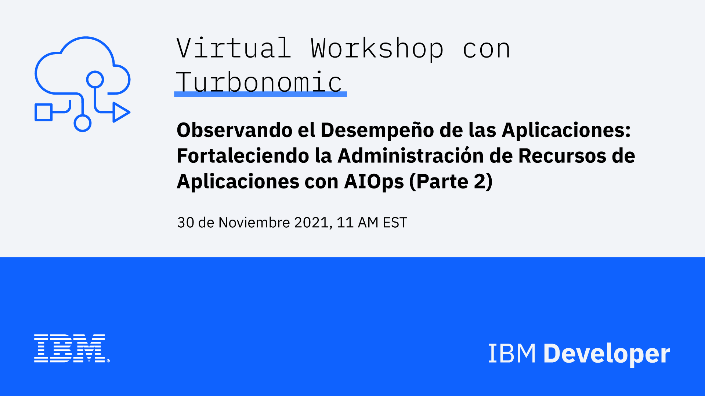

# IBM & Turbonomic - Observabilidad empresarial con Turbonomic (Parte II)

## Descripción

IBM & Turbonomic Presentan: Observando el desempeño de las aplicaciones: Fortaleciendo la Administración de Recursos de Aplicaciones con AIOps (Parte 2)

En esta sesión exclusiva de IBM Developer y Turbonomic, profundizaremos en la Observabilidad relacionada con el rendimiento de las aplicaciones.

A medida que las implementaciones en la nube se vuelven más complejas, las herramientas para administrar el rendimiento y la infraestructura de las aplicaciones se vuelven más críticas. Para abordar esta necesidad, Turbonomic creó una herramienta ARM (Gestión de Recursos de Aplicaciones) que ayuda a los operadores a comprender y gestionar la infraestructura de la nube para reducir los gastos operativos y mejorar el rendimiento de la nube.

En esta sesión, creada exclusivamente por IBM Developer y Turbonomic, realizaremos un análisis técnico profundo para resaltar cómo AIOps proporciona a las aplicaciones altamente distribuidas y dinámicas los recursos necesarios para funcionar con ARM. AIOps es la sección transversal de Observabilidad y accionabilidad, que ayuda a los clientes a automatizarse para centrarse en la innovación y ofrecer las mejores experiencias al cliente.

### Objetivos de Aprendizaje

En este webinar, los asistentes aprenderán sobre:

- Conceptos clave y el valor del AIOps
- Cómo el ARM aporta mayores niveles de automatización a las soluciones APM (Application Performance Monitoring) como Instana a través de AIOps
- Cómo la plataforma de Turbonomic trabaja junto con Instana para monitorear y administrar las implementaciones de OpenShift

## Speakers

- Josefina R. Casanova - IBM Developer Advocate
  -  [/josefinarcasanova](https://www.linkedin.com/in/josefinarcasanova/)
- Gabriela Retamosa - Build Ecosystem & Developer Advocacy 
  -  [@gabyret](https://twitter.com/gabyret)
  -  [/gabriela-retamosa-saint-martin](https://www.linkedin.com/in/gabriela-retamosa-saint-martin/)

## Enlaces de Interés

### Sesión

- [Regístrate en IBM Cloud](https://cloud.ibm.com/registration)
- [Ve el Replay (Próximamente)]()
- [Accede a las slides (Próximamente)]()

### ¡Hazlo tú mismo!

- [Prerequisitos - Observabilidad empresarial con Instana (Parte I)](../20211123%20-%20Observabilidad%20empresarial%20con%20Instana%20(Parte%20I)/README.md)
- [Tutorial: Mejore el rendimiento y la eficiencia en sus implementaciones de Red Hat OpenShift (Próximamente)]()
- [Entorno de prueba: Red Hat OpenShift (duración: una hora)](https://learn.openshift.com/playgrounds/openshift45)
- [Turbonomic Free Trial](https://marketplace.redhat.com/en-us/products/turbonomic-platform?_ga=2.229329884.1925654936.1619530033-739339010.1619530033)

### Lecturas Recomendadas1

- [Curso - IBM Cloud Essentials Course](https://cognitiveclass.ai/courses/ibm-cloud-essentials)
- [Digital Developer Conference - AIops & Integration](https://developer.ibm.com/conferences/digital-developer-conference-ai-automation-integration/)
- [Turbonomic Documentation](https://docs.turbonomic.com/)

### ¡Contáctanos!

-  ¿Tienes dudas? ¿Comentarios? ¿Quieres formar parte de una comunidad de desarrolladores de habla hispana? Entonces,[**¡conversemos en Discord!**](https://discord.gg/yBs8YSnx9m)
